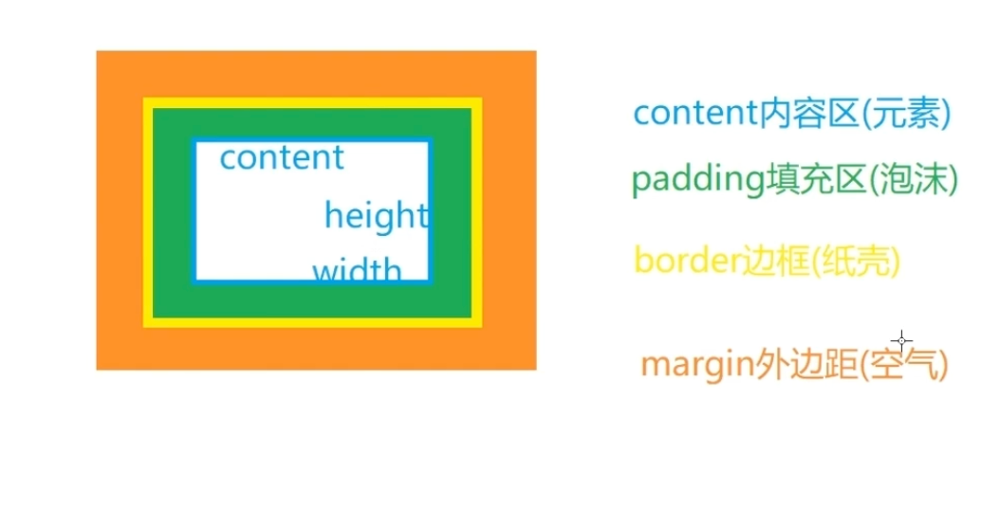
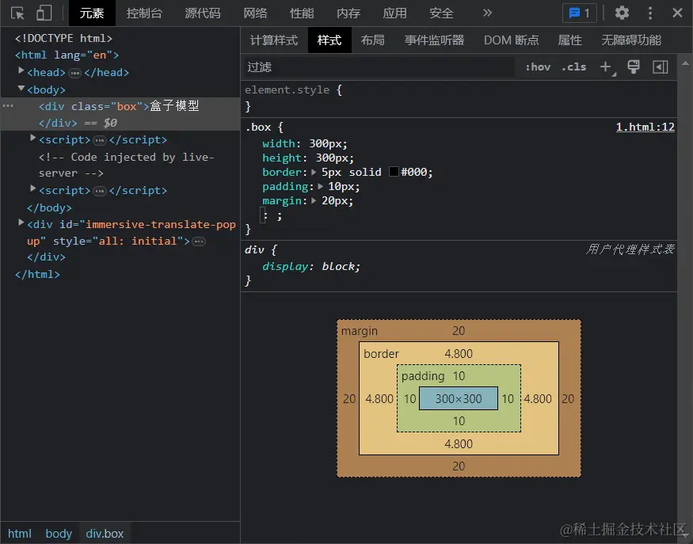
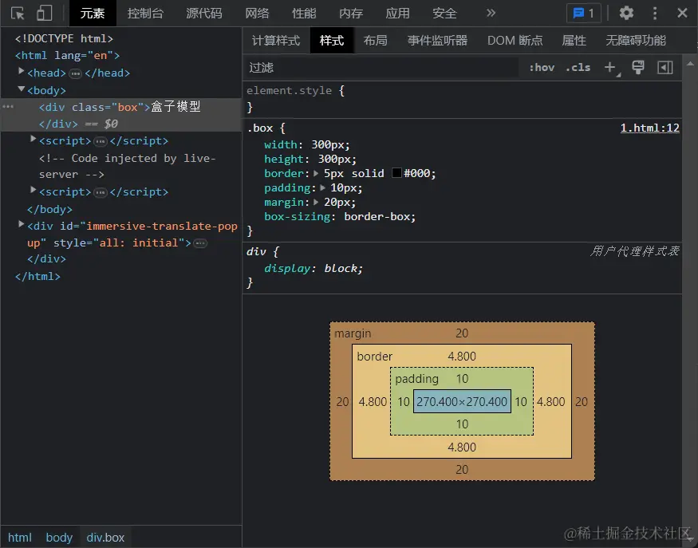
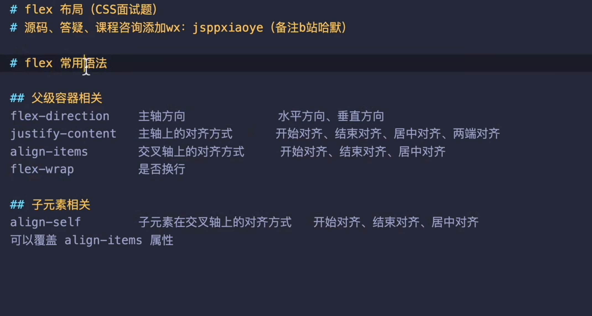

## 盒子模型

### 标准盒模型

标准盒模型的总宽度 == 宽width + 内边距padding + 边框border + 外边距margin

width=content区域的宽度





优先内容宽度可以用标准盒模型，box-sizing默认就是content-box

```css
box-sizing:content-box
```

### 怪异盒模型/IE盒模型

IE盒模型的总宽度 == 宽width + 外边距margin

width=content区域的宽度+padding+border宽度

设置的width就是边框、内边距、内容的宽度，会挤压内容，为了防止撑大你可以用IE盒模型

```css
box-sizing:border-box
```



## css单位

浏览器默认文字大小是16px

1. px : 像素单位 ，屏幕上的发光点

2. rem : 相对单位， 相对于根字体（html）大小，html默认就是16px

3. em : 相对单位，用于字体上其会继承父容器的字体大小，用在它处，是相对于当前容器自己的字体大小来定的

   font-size：1.17em，是16*1.17=18.72 px*

   margin-block-start：1em，是18.72*1=18.72 px

4. vh、vw：视口宽度

   vw ，就是根据窗口的宽度，分成100等份，100vw就表示满宽，50vw就表示一半宽。（vw 始终是针对窗口的宽），同理，`vh`则为窗口的高度

   这里的窗口分成几种情况：

   - 在桌面端，指的是浏览器的可视区域
   - 移动端指的就是布局视口

像`vw`、`vh`，比较容易混淆的一个单位是`%`，不过百分比宽泛的讲是相对于父元素：

- 对于普通定位元素就是我们理解的父元素
- 对于position: absolute;的元素是相对于已定位的父元素
- 对于position: fixed;的元素是相对于 ViewPort（可视窗口）


## 选择器优先级

```
!important > 内联样式 > id选择器 > 类名选择器 > 标签选择器
```

当多个选择器具有相同优先级时，后面的样式会覆盖前面的样式。如果两个选择器具有相同优先级且都使用了!important，则根据CSS规则，以代码中出现的顺序为准。

## BFC

BFC(Block formatting context)直译为"块级格式化上下文"。它是一个独立的渲染区域，有自己的渲染规则，注意是针对块元素。隔绝了内外部联系，内部渲染不影响外部；不同的BFC之间渲染也不互相干扰。

### 常规渲染的问题：常规流的块元素的问题

1.垂直方向上相邻的元素，会产生**margin合并**，上面一个margin-bottom和下一个的margin-top会合并，总是取较大的那一个

2.父子关系下，会产生**margin塌陷**，子元素的上下margin被父元素抢走

3.父子关系下，父元素无视浮动元素会产生**高度塌陷**

4.兄弟元素情况下，上面的元素浮动，下面的元素会往上移动**被浮动元素覆盖**

### 开启解决的问题

1.开启**父元素**BFC，其子元素不会有margin塌陷问题

2.开启**父元素**BFC，其子元素浮动，自身高度不会坍塌

3.开启BFC，**自已**不会被其他浮动元素覆盖

### 如何开启？

0.根元素（HTML）本身是一个BFC元素

1.设置float属性

2.设置position:absolute或fixed

3.设置overflow，属性值不为默认的visible即可

4.行内块元素（dispaly:inline-block）

5.display:flow-root(不兼容IE)

## 垂直居中

子绝父相原因：子元素会向上找相对第一个开启相对定位的祖先元素进行绝对定位。**父元素没有定位**，则以**浏览器**为准定位（Document 文档）。

### 块级

#### 定位（子绝父相）+margin：auto

- 设置子元素top、bottom、left、right为0

- 设置子元素宽高（子元素虚拟占位已经撑满了整个父元素）

- 设置margin：auto

`不需要知道子元素的宽高`

#### 定位（子绝父相）+margin：负值/transform: translate(-50%, -50%);

- 设置子元素top和left50%定位把子元素移动父元素的一半宽高，此时子元素中心点和父元素中心点位置横向和纵向都多移动了一半子元素宽高

- 子元素往回移动自己的一半宽高

`margin：负值需要知道子元素的宽高，translate不需要`

参考：

https://zhuanlan.zhihu.com/p/278023481

#### flex布局

```css
display: flex;
justify-content: center;
align-items: center;
```

`不需要知道子元素的宽高`

### 内联元素居中布局

#### 水平居中

- 行内元素可设置：text-align: center
- flex布局设置父元素：display: flex; justify-content: center

#### 垂直居中

- 单行文本父元素确认高度：height === line-height

- 多行文本父元素确认高度：display: table-cell; vertical-align: middle

  或者line-height=height/行数n，两者的表现不同。

  

## 浏览器重排、重绘

### 定义

重排（回流）：浏览器要根据样式**计算**出盒模型在页面上的大小和位置

重绘：将计算好盒模型的的大小和位置之后，浏览器会根据每个盒模型的特性进行**绘制**

浏览器渲染机制：

1. 解析HTML和CSS生成DOM树和CSS树

2. DOM树和CSS树结合成渲染树

3. Layout(回流):根据生成的渲染树，进行回流（Layout），**计算**得到节点的几何信息（位置和大小）

4. Painting(重绘):根据渲染树和回流得到的几何信息，得到节点的绝对像素**绘制**出元素


### 触发原因

第一次渲染一定是重排+重绘

修改dom元素的大小、位置，浏览器需要重新计算元素的几何信息，会触发重排

修改dom元素的样式，浏览器不需要重新计算几何信息，只触发重绘

重排之后一定触发重绘，重绘不一定重排

### 触发重排的方式

1.改变 DOM 元素的几何属性:高度、大小、位置

2.改变 DOM 树的结构：添加删除元素、元素内的内容变化（文本、图片）

3.获取一些特定属性的值时，浏览器为了获取这些值，也会进行重排

offsetTop、offsetLeft、 offsetWidth、offsetHeight、scrollTop、scrollLeft、scrollWidth、scrollHeight、clientTop、clientLeft、clientWidth、clientHeight

4.浏览器的窗口变化

5.页面第一次渲染

### 触发重绘的方式

元素颜色、背景、阴影等样式修改

### 如何规避回流与重绘

略

## 有哪些方式隐藏页面元素？区别？

1.display:none

页面不显示元素，不占据位置，页面不渲染元素，触发重排重绘

2.visibility:hidden

元素不可见，但占据位置，页面渲染元素，只触发重绘

3.opacity:0

元素透明，占据位置，页面渲染元素，只触发重绘

三种方式都不删除dom节点

## flex布局

### 概念



参考：

https://www.ruanyifeng.com/blog/2015/07/flex-grammar.html

### 列表最后一行左对齐

flex-wrap

:after伪元素

https://www.bilibili.com/video/BV1Xo4y1Q7oR/?spm_id_from=333.337.search-card.all.click&vd_source=3410b2da3067aa982b0768059588737c

## flex布局子级属性（了解）

### flex-grow

有空间是否放大，默认0，不放大，可以设置放大比例

### flex-shrink

空间不足是否缩小，默认1，缩小，可以设置缩小比例

### flex-basis属性

`flex-basis`属性定义了在分配多余空间之前，项目占据的主轴空间（main size）。浏览器根据这个属性，计算主轴是否有多余空间。它的默认值为`auto`，即项目的本来大小

### 项目元素的flex属性

`flex`属性是`flex-grow`, `flex-shrink` 和 `flex-basis`的简写，默认值为`0 1 auto`。后两个属性可选。

`flex：1`是1 1 0，分配前所有元素都为0，剩余空间为整个容器，完全交给浏览器平均分配

`flex；auto`是1 1 auto，按照元素原本的长度计算剩余空间，再进行分配

`flex：none`是0 0 auto

使用场景：

需要对元素等分时适合`flex：1`，此时压缩较大的内容，拉伸较小的内容形成等分。

需要让元素按照自己的长度`flex：auto`，此时优先最大化最大的一块内容尺寸，压缩其他空间

参考：https://juejin.cn/post/7140121864285716516

补充：

设置flex后，align-items默认为strech，元素高度会自动填满交叉轴

设置flex：wrap并压缩浏览器窗口宽度，换行的元素如果是写死了height则不会默认撑开填满高度，不写死则可以撑满剩余的高度。如果所有元素都不写死撑开的高度默认是**平分**剩余的高度，如果某个元素内部存在子元素，子元素自身设置高度后导致其父元素撑开的高度是整体高度减去子元素高度后/2再加子元素的高度。
