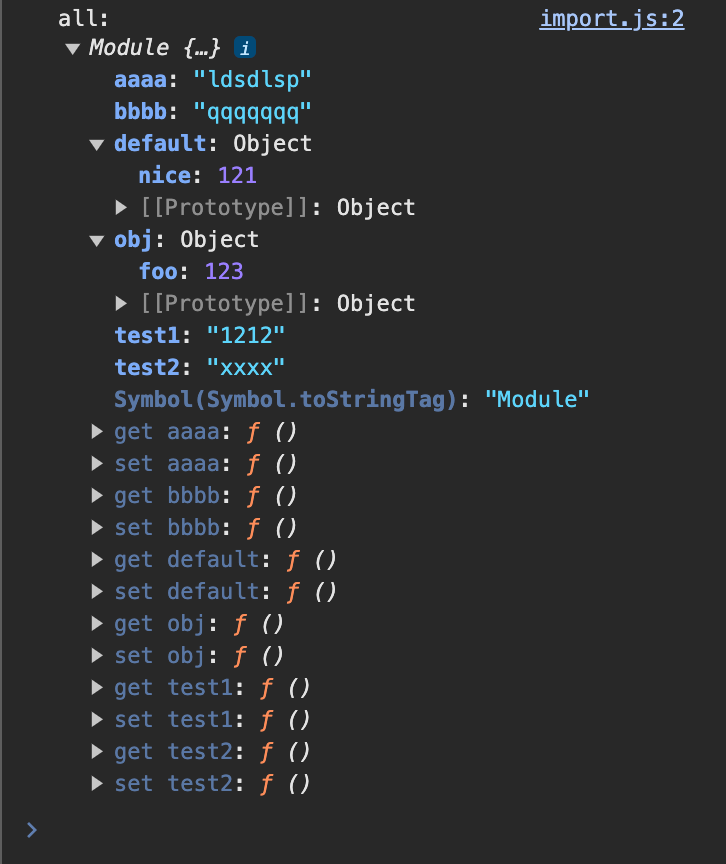

## 面试官：说说var、let、const之间的区别

var会发生变量提升，可以重复声明相同的变量

var**非函数中**声明的变量是顶层对象的属性，也是全局变量

var**函数中**声明的对象是局部的

**如果不使用var**,变量不管在哪声明都是全局的且都是顶层对象的属性。

> 注意：顶层对象浏览器是window对象，node是global
>

let不会变量提升，存在暂时性死区（未声明之前使用会报错），**相同作用域下**不可以重复声明。存在块级作用域概念，只在声明的块级作用域作用下生效。

const是常量，一旦声明必须立刻初始化，之后不可以修改值。不可以对var或let声明过的变量重新声明。

## 面试官：ES6中数组新增了哪些扩展？

### 扩展运算符

在数组和函数参数中使用扩展运算符时，只能在可迭代对象中使用

```js
var a={0:12,1:2112,2:'wqwq',length:3}
[...a]//在数组中使用：TypeError，一般的类数组时可遍历对象，但不是可迭代对象
{...a}//在对象中使用：{0: 12, 1: 2112, 2: 'wqwq', length: 3}
[...arguments]//arguments对象正常使用，因为arguments中实现了迭代器，是可迭代对象
```

### 构造函数下新增的数组方法

#### Array.from

将可迭代对象(Map，Set等)和类数组对象（自建类数组、arguments）转化为数组。

```js
var arrLike = {
  0: 'name',
  1: 'age',
  2: 'job',
  length: 3,
};

let set = new Set(['red', 'green', 'blue']);

let arr = Array.from(arrLike); //['name', 'age', 'job']
let arr2 = Array.from(set); //['red', 'green', 'blue']
```

#### Array.of()

用于将一组值，转换为数组

```js
Array.of(3, 11, 8) // [3,11,8]
```

参数的时候，返回一个空数组

当参数只有一个的时候，实际上是指定数组的长度

参数个数不少于 2 个时，`Array()`才会返回由参数组成的新数组

## 实例对象新增的方法

#### copyWithin

```js
[1, 2, 3, 4, 5].copyWithin(0, 3) // 将从 3 号位直到数组结束的成员（4 和 5），复制到从 0 号位开始的位置，结果覆盖了原来的 1 和 2
// [4, 5, 3, 4, 5]
```

#### fill

使用给定值，填充一个数组

```javascript
['a', 'b', 'c'].fill(7)
// [7, 7, 7]

new Array(3).fill(7)
// [7, 7, 7]
```

#### entries()，keys()，values()

`keys()`是对键名的遍历、`values()`是对键值的遍历，`entries()`是对键值对的遍历

#### flat()，flatMap()

将数组扁平化处理，返回一个新数组，对原数据没有影响

`flat()`默认只会“拉平”一层，如果想要“拉平”多层的嵌套数组，可以将`flat()`方法的参数写成一个整数，表示想要拉平的层数，默认为1

`flatMap()`方法对原数组的每个成员执行一个函数相当于执行`Array.prototype.map()`，然后对返回值组成的数组执行`flat()`方法。该方法返回一个新数组，不改变原数组

```js
//相当于[2, 3, 4].map((x) => [x, x * 2]).flat()
[2, 3, 4].flatMap((x) => [x, x * 2])
// [2, 4, 3, 6, 4, 8]
```

## 面试官：对象新增了哪些扩展？

略

## 面试官：对象新增了哪些扩展？

### 函数的length属性

参数长度

### name属性

### 参数的默认值会形成一个单独的作用域

```js
let x = 1;

function f(y = x) { 
  // 等同于 let y = x  
  let x = 2; 
  console.log(y);
}

f() // 1
```

### 严格模式

只要函数参数使用了默认值、解构赋值、或者扩展运算符，那么函数内部就不能显式设定为严格模式，否则会报错

### 箭头函数

## 面试官：你是怎么理解ES6新增Set、Map两种数据结构的？

### Set

无序不重复的元素集合，可以接收一个可迭代对象作为参数。

本身是可迭代对象，不是可遍历对象，需要用forof和自身api遍历。

```js
let set = new Set(['red', 'green', 'blue']);
```

### Map

键值对的有序列表，而键和值都可以是任意类型，可以接收一个二维数组作为参数。
本身是可迭代对象，不是可遍历对象，需要用forof和自身api遍历。

```javascript
const map = new Map([
  ['F', 'no'],
  ['T',  'yes'],
]);
```

Map和Set都可以用keys(),values(),entries()遍历

Map还可以用Map.prototype.forEach()遍历，Set还可以用Set.prototype.forEach()遍历

补充：对象的key只能是字符串，value可以是任何类型，map的key和value都可以是任意类型。map可以看作是对键值对的一种扩充。

### WeakSet

成员只能是引用类型(除了null)

没有遍历操作的api

没有size属性

### WeakMap

键名只能是引用类型(除了null)

没有遍历操作的api

没有`clear`清空方法

#### 使用场景

作为key的对象失去引用时（引用的变量设为null），WeakMap记录自动移除

## 继承

### 原型链继承

### 构造函数继承

### 组合继承

### 寄生组合继承

##  面试官：你是怎么理解ES6中Module的？使用场景？

### CommonJs

exports导出模块的原理是将exports指向module.exports，可以简单的理解为CommonJS在每个模块头部添加了如下代码：

```js
var module = {
    exports: {},
}
var exports = module.exports
```

```js
// a.js
module.exports={ foo , bar}
//等同于
exports.foo = foo
exports.bar = bar

// b.js
const { foo,bar } = require('./a.js')
```

导出的注意事项：

1）**不要直接给exports赋值**

直接给exports赋值会将导致exports指向一个新的对象，但是module.exports依然是原来的空对象。module.exports指向的对象才是真正存储着我们要导出的模块，exports只是被通过赋值语句指向了module.exports

expotrs=>module.exports=>导出的模块对象

2）**尽量不混用module.exports和exports**

```js
exports.add = function(a, b) {
    return a + b
}
module.exports = {
  name: 'calculater'
}
```

最终导出的对象是`{name: 'calculater'}`

3）**导出语句不代表模块末尾**

我们常常将导出代码写在程序的末尾，但实际上导出语句并不代表模块末尾，在module.exports和exports后面的代码依然会被执行。我们之所以将他们写在末尾，是为了提高代码的可读性。

导入的注意事项：

一个模块被require首次导入，会先执行该模块代码，然后导出内容到当前模块。若在一个模块中我们使用require导入另一个模块多次，被导入的模块只会被执行一次，后面的导入会直接导入第一次执行的结果。

参考：

https://www.zhihu.com/tardis/bd/art/643416626?source_id=1001

## ES6 Module

### 基本用法

```js
export var a =123//export default跟变量声明
export var b ='wqwqwq'
//或者
export {a,b}//这里不是对象，是上面写法的语法糖

export function abc() {}

export default a//export default跟js变量
export default {foo:1221}//这是对象
export default function abc() {}
```

ES6模块内部默认开启了严格模式

```javascript
// profile.js
export var firstName = 'Michael';
export var lastName = 'Jackson';
export var year = 1958;

或 
// 建议使用下面写法，这样能瞬间确定输出了哪些变量
var firstName = 'Michael';
var lastName = 'Jackson';
var year = 1958;

export { firstName, lastName, year };
```

通过`as`可以进行输出变量的重命名

```js
function v1() { ... }
function v2() { ... }

export {
  v1 as streamV1,
  v2 as streamV2,
  v2 as streamLatestVersion
};
```

这样导出的模块按照以下方式导入：

```javascript
import { firstName, lastName, year } from './profile.js';
```

同样如果想要输入变量起别名，通过`as`关键字

```javascript
import { lastName as surname } from './profile.js';
```

当加载整个模块的时候，需要用到星号`*`，此时必须要使用as起别名

```js
// circle.js
export function area(radius) {
  return Math.PI * radius * radius;
}

export function circumference(radius) {
  return 2 * Math.PI * radius;
}

// main.js
import * as circle from './circle';
console.log(circle)   // {area:area,circumference:circumference}
```

导入的变量都是只读的，即使是对象也不建议进行修改

```js
import {a} from './xxx.js'

a.foo = 'hello'; // 合法操作
a = {}; // Syntax Error : 'a' is read-only;
```

`import`后面我们常接着`from`关键字，`from`指定模块文件的位置，可以是相对路径（'./a'不能省略'./'），也可以是绝对路径

```js
import { a } from './a';
```

如果只有一个模块名，需要有配置文件，告诉引擎模块的位置。其实就是在配置别名，别名可以用来指定可以省略后缀的文件类型，也可以自定义到指定路径下的文件

```javascript
import { myMethod } from 'util';
```

每个文件可以有多个export和一个export default(default是保留字，不能用作变量名，所以import导入全部时的Module对象中的自定义的属性名不会和default冲突)

```js
// export-default.js
export default function () {
    console.log('foo');
}
```

加载该模块的时候，`import`命令可以为该函数指定任意名字

```js
// import-default.js
import customName from './export-default';
customName(); // 'foo'
```

导入export default有两种方式，第二种为第一种的语法糖，本质都是起别名，default必须起别名

```js
import { default as defImpt } from "./b.js";

import defImpt2 from "./b.js";
```

实例：

```js
//export default+变量
export default {
  nice: 121,
};

export var aaaa = 'ldsdlsp';
export var bbbb = 'qqqqqqq';
export var obj = { foo: 123 };

//可以看作是上面写法的语法糖，这里的大括号不是对象，是ES6 Module的语法
var test1 = '1212';
var test2 = 'xxxx';
export { test1, test2 };
```

```js
import * as all from './b.js';
import { aaaa } from './b.js';//这里的大括号也是ES6 Module的语法
import defImpt from './b.js';

console.log('all:', all);
console.log('aaaa :', aaaa);//aaaa : ldsdlsp
console.log('defImpt :', defImpt);//defImpt : {nice: 121}
```



### 动态加载

允许您仅在需要时动态加载模块，而不必预先加载所有模块，这存在明显的性能优势

这个新功能允许您将`import()`作为函数调用，将其作为参数传递给模块的路径。 它返回一个 `promise`，它用一个模块对象来实现，让你可以访问该对象的导出

```js
import('/modules/myModule.mjs')
  .then((module) => {
    // Do something with the module.
  });
```

###  复合写法

如果在一个模块之中，先输入后输出同一个模块，`import`语句可以与`export`语句写在一起

```javascript
export { foo, bar } from 'my_module';

// 可以简单理解为
import { foo, bar } from 'my_module';
export { foo, bar };
```

同理能够搭配`as`、`*`搭配使用

参考：

https://vue3js.cn/interview/es6/module.html

## 模块规范兼容

**浏览器环境默认只支持ESModule，node环境默认只支持CommonJs**

### 如何兼容

1. 浏览器环境使用script标签时加上type=module，可以使导入的js使用ESModule

```html
<script type="module" src="./class2.js"></script>
```

2. webpack默认把ESModule编译成Commonjs并在require上添加相关方法模拟ESModule功能特性，Commonjs编译后不变。两者都会添加运行时代码，使浏览器兼容Commonjs。
3. node环境可以使用babel-node、webpack使其支持ESModule
4. 在支持js模块化的浏览器中直接使用ESModule，浏览器引擎中有对ESModule的实现。不支持模块化的浏览器可以通过打包工具实现模块化

https://blog.csdn.net/weixin_44502231/article/details/124133122

### ESModule和Commonjs的区别

1.ES模块规划**导出**的是值的引用（使用getter函数闭包保持对外部值的引用），如果模块内的值发生变化，外部永远取到的是最新的值。Commonjs**导出**的是值本身，模块值的变化，外部取值不会变化。

2.ESModule是编译时加载，必须放在顶部。Commonjs是运行时加载。

3.ESModule只能同步加载，Commonjs支持异步加载。

https://blog.csdn.net/m0_73574455/article/details/144631226
