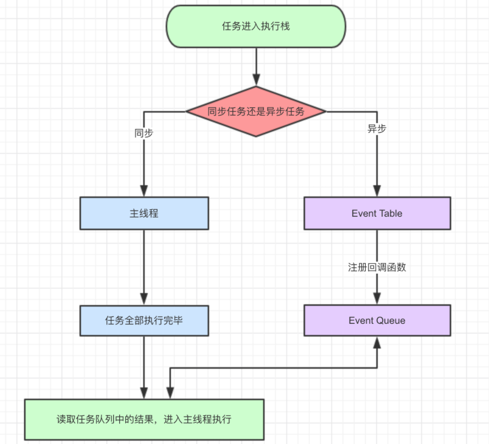
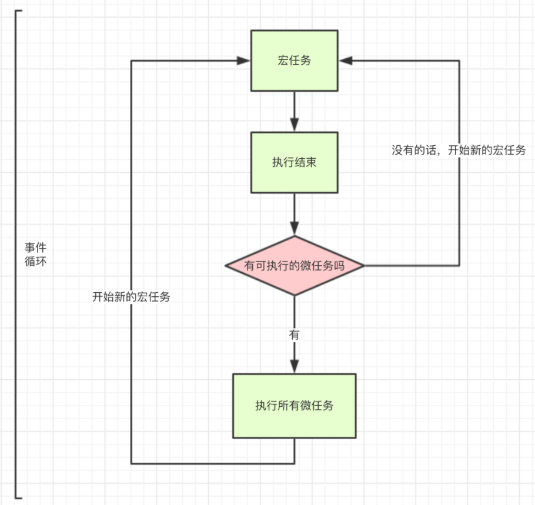

## 数据类型

number、string、boolean、symbol、bigint、undefined、null

## 数字精度丢失问题

1.计算机存储双精度浮点数需要先把十进制数转换为二进制的科学记数法的形式。

2.然后计算机以自己的规则{符号位+(指数位+指数偏移量的二进制)+小数部分}存储二进制的科学记数法

3.因为存储时有**位数限制**（64位），并且某些十进制的浮点数在转换为二进制数时会出现**无限循环**，会造成二进制的舍入操作(0舍1入)，当精度出现了偏差的二进制数计算完再将结果转换为十进制时就造成了计算误差

## 事件模型

事件：加载事件、鼠标事件、自定义事件

事件流的阶段：

- 事件捕获阶段(capture phase)
- 处于目标阶段(target phase)
- 事件冒泡阶段(bubbling phase)

事件模型：

1.原始事件模型（DOM0级）

特点：

- 只支持冒泡，不支持捕获
- 同一个类型的事件只能绑定一次

方式：

- HTML代码中直接绑定

	 ```html
  <input type="button" onclick="fun()">
  ```

- 通过`JS`代码绑定

- ```js
  var btn = document.getElementById('.btn');
  btn.onclick = fun;
  ```

2.标准事件模型（DOM2级）

方式：

```js
addEventListener
```

在该事件模型中，一次事件共有三个过程:

- 事件捕获阶段：事件从`document`一直向下传播到目标元素, 依次检查经过的节点是否绑定了事件监听函数，如果有则执行
- 事件处理阶段：事件到达目标元素, 触发目标元素的监听函数
- 事件冒泡阶段：事件从目标元素冒泡到`document`, 依次检查经过的节点是否绑定了事件监听函数，如果有则执行

特点：

- 可以在一个`DOM`元素上绑定多个事件处理器，各自并不会冲突
- 执行时机：当第三个参数(`useCapture`)设置为`true`就在捕获过程中执行，反之在冒泡过程中执行处理函数

3.IE事件模型（基本不用）

方式：

```text
attachEvent(eventType, handler)
```
IE事件模型共有两个过程:
- 事件处理阶段：事件到达目标元素, 触发目标元素的监听函数。
- 事件冒泡阶段：事件从目标元素冒泡到`document`, 依次检查经过的节点是否绑定了事件监听函数，如果有则执行

## new

构造函数返回对象会被使用，返回原始值不会使用

新建的对象(需要时构造函数本身的实例)可以访问构造函数的实例对象属性、原型链对象属性

手写new

```js
function new2(func, ...args) {
  const obj = {};
  obj.__proto__ = func.prototype;
  const res = func.apply(obj, args);
  return typeof res === 'object' ? res : obj;
}
```

## 闭包

一个函数和其词法作用域的组合是闭包

使用场景

- 创建私有变量

- 延长变量的生命周期

1.函数柯里化

2.模拟私有方法

3.面试题：

```js
var funcs = [];
for (var i = 0; i < 3; i++) {
    funcs[i] = function () {
        console.log(i);
    };
}
funcs[0](); // 3
```

使用闭包

```js
var arr = [];
for (var i = 0; i < 3; i++) {
  (function (i) {
    arr[i] = function () {
      console.log(i);
    };
  })(i);
}

arr[0]();//0
```


## debounce

防抖：n秒后执行，如果在n秒内重新触发，则重新计时

节流：n秒内只执行一次，若在n秒内触发多次，只执行一次

## GC机制

垃圾的概念：我们觉得我们不再需要的内存空间

垃圾回收器：回收我们觉得我们不再需要的内存空间中不可触达的部分

垃圾回收操作是JS自己的垃圾回收器做的，当内存不再使用时，自动释放它。

开发人员要做的就是确定哪一块内存是不需要再使用的，使其变得不可触达。

### 垃圾回收算法

标记清除

这个算法把“对象是否不再需要”简化定义为“**对象是否可以获得**”。

引用计数

此算法把“对象是否不再需要”简化定义为“**对象有没有其他对象引用到它**”。

## 内存泄露

概念：我们不再需要的内存空间（垃圾）中还可以触达的部分没有被垃圾回收机制回收。

解决：让这些不再需要的内存空间从可以触达变成不可触达

### 常见的内存泄漏

#### 全局变量

原因：

全局对象window会保持对不再需要的全局变量的引用，导致其始终可以触达不会被回收。

全局变量可以不声明就赋值创建、可以在函数中用this创建、也可以显式创建

解决：

对不再需要的全局变量设置为null

#### 闭包

原因：

1.持有了不再需要的闭包函数引用，会导致函数关联的词法环境无法销毁，从而导致内存泄露。

2.当多个闭包函数共享词法环境时，会导致词法环境膨胀，从而导致出现无法触达也无法回收的内存空间。

## js本地存储

- cookie
- sessionStorage
- localStorage
- indexedDB

## proxy

代理Map，Set类型对象时的注意点：

https://blog.csdn.net/qq_28550263/article/details/128439767

基本使用：

https://es6.ruanyifeng.com/#docs/proxy

## typeof和instanceof

### typeof

```js
console.log(typeof 2);              
console.log(typeof true);            
console.log(typeof 'str');          
console.log(typeof []);              
console.log(typeof function(){});   
console.log(typeof {}); 
console.log(typeof undefined);  
console.log(typeof null);          
```

其中数组、对象、null都会被判断为object，其他判断都正确。

### instanceof

  **instanceof** 是用来检测[构造函数](https://so.csdn.net/so/search?q=构造函数&spm=1001.2101.3001.7020)的 **prototype** 属性是否出现在某个[实例对象](https://so.csdn.net/so/search?q=实例对象&spm=1001.2101.3001.7020)的原型链上。

```js
console.log(2 instanceof Number);                    // false
console.log(true instanceof Boolean);                // false 
console.log('str' instanceof String);                // false 
 
console.log([] instanceof Array);                    // true
console.log(function(){} instanceof Function);       // true
console.log({} instanceof Object);                   // true
```

只能判断引用数据类型，不能判断原始数据类型。`instanceof` 运算符可以用来测试一个对象在其原型链中是否存在一个构造函数的 `prototype` 属性。

手写instanceof

```js
function myInstanceof(left, right) {
  if ((typeof left != 'function' && typeof left != 'object') || left == null)
    return false;
  var prototype = Object.getPrototypeOf(left);
  // 原型链循环往上找原型对象，找到对象的构造函数的prototype（第一层是构造关系）、继承的父类的prototype、Object的prototype（由于构造函数的原型是对象，由Object构造，所以其原型节点指向Object.prototype。综上原型链查找可以找到Object.prototype，所以对象继承自Object）、null(Object.prototype对象的原型节点指向的是null)
  while (true) {
    console.log('prototype :', prototype);
    if (prototype === null) return false;
    if (prototype === right.prototype) return true;
    prototype = Object.getPrototypeOf(prototype);
  }
}
```

补充：构造和继承的区别

对象的第一层原型对象属于的函数是构造函数，之后几层原型对象属于的构造函数都是继承。

只要子类中带有父类的属性都是继承：包括父类的原型对象和实例属性

如果子类原型节点可以查找到父类的原型对象，则子类是父类的实例（instanceof原型链查找逻辑）


## 函数式编程

### 函数组合

接收多个函数作为参数，从右到左执行，一个函数的输出为另一个函数的输入

手写compose、pipe

```js
function pipe(...funcs) {
  return function (param) {
    return funcs.reduce((val, func) => {
      return func(val);
    }, param);
  };
}

function compose(...funcs) {
  return function (param) {
    return funcs.reduceRight((val, func) => {
      return func(val);
    }, param);
  };
}

```

### 函数柯里化

将一个多元函数转变为一元函数的过程。 每当函数被调用时，它仅仅接收一个参数并且返回带有一个参数的函数，直到传递完所有的参数。

手写curry

```js
function sum(a, b, c) {
  return a + b + c;
}

sum(1, 2, 3);
currySum(1)(2)(3);
// sum改成柯里化：每一层嵌套函数都收集一个参数，需要的参数集齐后调用原函数
function currySum(a) {
  return function (b) {
    return function (c) {
      return sum(a, b, c);
    };
  };
}

// 每传递一个参数，返回一个函数继续供传递后面的参数调用
// 直到传递完所有参数，使用所有参数调用原函数
// 原函数结果值返回给最后一个构建的函数，并由这个函数返回出来
function curry(func) {
  return function nest(...args) {
    if (func.length === args.length) {
      return func(...args);
    } else {
      return function (newArg) {
        return nest(...args, newArg);
      };
    }
  };
}
```

## 实现ajax请求

手写封装xhr api

```js
function ajax(options) {
  const xhr = new XMLHttpRequest();
  options.dataType = (options.dataType || 'get').toUpperCase();
  xhr.open(options.dataType, options.url, true);
  xhr.setRequestHeader('content-type', 'application/json');
  xhr.send(options.dataType === 'POST' ? options.params : null);
  xhr.onreadystatechange = () => {
    let status = xhr.status;
    if (xhr.readyState != 4) return;
    if (status === 200) {
      options.success && options.success(xhr.response);
    } else {
      options.fail && options.fail(xhr.statusText);
    }
  };

  xhr.onerror = () => {
    options.fail && options.fail(xhr.statusText);
  };
}
```

## event loop

### js单线程

为什么是单线程？

js是浏览器脚本语言，通常用于操作dom，多线程会导致dom操作错乱。

但是单线程运行过程中可能出现阻塞，js使用事件循环（Event Loop）机制来解决

### 同步任务和异步任务

同步任务是立即执行的任务，一般直接进入到主线程中执行

异步任务是异步执行的任务



同步任务进入主线程（即主执行栈），异步任务进入任务队列。主线程内的的任务执行完毕，再去将任务队列中的任务推入主线程执行。这个不断循环的过程就是事件循环

### 微任务和宏任务

异步任务可以分为宏任务和微任务

1.微任务是一个需要异步执行的函数

常见的微任务：

- Promise.then

2.宏任务时间粒度较大，执行的时间间隔不能精确控制

- script (可以理解为外层同步代码)
- setTimeout/setInterval
- UI rendering/UI事件
- postMessage、MessageChannel
- setImmediate、I/O（Node.js）

也就是说任务队列会区分宏任务队列，和微任务队列，遇到异步任务会分别放到不同队列



宏任务执行完成，查看微任务队列是否有可执行的微任务。如果有就执行所有微任务，然后执行宏任务；如果没有就继续开始新的宏任务。

```js
console.log(1)
setTimeout(()=>{
    console.log(2)
}, 0)
new Promise((resolve, reject)=>{
    console.log('new Promise')
    resolve()
}).then(()=>{
    console.log('then')
})
console.log(3)
```

结果：1 'new Promise' 3 'then' 2

### async与await

await会阻塞后面的代码

```js
  await fn2()
  console.log(2) // 阻塞
```

相当于

```js
new Promise((resolve,reject)=>{
	fn2()
	resolve();
}).then((res)=>{
	 console.log(2) 
})
```

流程分析

```js
async function async1() {
    console.log('async1 start')
    await async2()
    console.log('async1 end')
}
async function async2() {
    console.log('async2')
}
console.log('script start')
setTimeout(function () {
    console.log('settimeout')
})
async1()
new Promise(function (resolve) {
    console.log('promise1')
    resolve()
}).then(function () {
    console.log('promise2')
})
console.log('script end')
```

结果：'script start' 'async1 start'  'async2' 'promise1' 'script end' 'async1 end' 'promise2' 'settimeout'

## 深浅拷贝

手写浅拷贝

```js
// 优化：判断源数据是否为对象类型，兼容数组
function shallowCloneOpmt(source) {
  if (typeof source != 'object' || source === null) return source;
  // const target = source instanceof Array ? [] : {};
  let target = new source.constructor();
  // 循环一层属性，进行克隆
  for (var key in source) {
    if (Object.hasOwnProperty.call(source, key)) {
      target[key] = source[key];
    }
  }

  return target;
}
```

手写深拷贝

```js
// deepClone
// 完全拷贝，新旧对象的深层对象不会相互影响
function deepClone(obj, map = new WeakMap()) {
  if (typeof obj !== 'object' || obj === null) return obj; //递归出口
  // date类型和正则直接用构造函数克隆
  // if (obj instanceof Date) return new Date(obj);
  // if (obj instanceof RegExp) return new RegExp(obj);
  if (/^(Function)|(Date)|(RegExp)|(Map)|(Set)$/i.test(obj.constructor.name)) {
    return new obj.constructor(obj);
  }
  // map标记每一个出现过的属性，避免循环引用
  if (map.get(obj)) return map.get(obj);
  let cloneObj = new obj.constructor();
  map.set(obj, cloneObj);
  // 对每个属性进行递归，如果是对象继续递归，如果不是直接返回，返回后完成克隆
  for (const key in obj) {
    if (Object.prototype.hasOwnProperty.call(obj, key)) {
      cloneObj[key] = deepClone(obj[key], map);
    }
  }

  return cloneObj;
}

```

## 手写bind

```js
Function.prototype.bind3 = function (oThis) {
  let originalFunc = this;
  let args = Array.prototype.slice.call(arguments, 1);
  const fBound = function () {
    originalFunc.apply(
      this instanceof fBound ? this : oThis,
      args.concat(Array.prototype.slice.call(arguments)),
    );
  };

  fBound.prototype = Object.create(originalFunc.prototype);

  return fBound;
};
```

## 类型转换

### 显示转换

- Number()
- parseInt()
- String()
- Boolean()

### 隐式转换

js中运算符运算时，如果两边数据不统一，编译器会自动将两边的数据转换成一致的再进行计算

### 场景

- 比较运算符
- if、while
- 算数运算符
- 字符串连接符
- 逻辑非运算符

### 转换规则

不同运算符最终运算时转成的类型：

1. 转成 string 类型： +（字符串连接符） 调用String()

2. 转成 number 类型：++ --（自增自减运算符）+ - * / % **（算术运算符）> < >= <= == !=（关系运算符）对象先toString()后Number(),如果toString后可以字符串拼接就拼接。其他类型的数据直接 Number()

3. 转成 boolean 类型：! !!（逻辑非运算符）、if、while 调用Boolean()

   > 这里值得注意的 + ，它既是连接符，也是运算符。 1. 当 + 两边都有值，且至少一个值是字符串类型，就会出现字符串拼接。2. 当只有 + 后面有值，例如:`+"123"`等同于`Number("123")`，会将字符串转换为数字123

转成 number 类型时不同类型转换的规律


比如 '0'==true

'0'->0

true->1

运算符两边转化结果0==1 ，结果是false

比如'0'+123结果是'0123'

比如true+123结果是124

if('0')内部的'0'调用Boolean('0')返回true，所以结果是符合条件

!'0'会调用Boolean('0')返回true,然后！结果是false

参考

https://www.cnblogs.com/MrZhujl/p/14646846.html

## new的时候做了什么

调用构造函数，如果返回对象，new就返回对象；如果不是对象，新建一个对象，原型节点指向构造函数原型对象，返回这个对象

```
function new3(func, ...args) {
  const obj = {};
  // obj.__proto__ == func.prototype;
  Object.setPrototypeOf(obj, func.prototype);
  const res = func.apply(this, args);
  return typeof res === 'object' ? res : obj;
}
```

## 防抖节流

手写防抖

```js
// 防抖
function debounced(func, wait) {
  let timer;
  return function () {
    if (timer) clearTimeout(timer);
    timer = setTimeout(() => {
      func.apply(this, arguments);
    }, wait);
  };
}

```

手写节流

```js
// 节流
function throttle(func, wait) {
  let timer;
  return function () {
    if (!timer) {
      timer = setTimeout(() => {
        func(this, arguments);
        timer = null;
      }, wait);
    }
  };
}

```

## 函数执行上下文

- 全局执行上下文：只有一个，浏览器中的全局对象就是 `window`对象，`this` 指向这个全局对象
- 函数执行上下文：存在无数个，只有在函数被调用的时候才会被创建，每次调用函数都会创建一个新的执行上下文

执行上下文的生命周期包括三个阶段：创建阶段 → 执行阶段 → 回收阶段

1. 创建阶段

- 确定 this 的值，也被称为 `This Binding`
- LexicalEnvironment（词法环境） 组件被创建，存放函数、let和const定义的变量

​	let和const定义的变量a和b在创建阶段没有被赋值保持uninitialized(未初始化状态)，但var声明的变量从在创建阶段被赋值为undefined。所以执行时var声明的变量可以在声明前打印出undefined，let和const声明前打印会报错，这就是变量提升的原因。

​	另外执行上下文创建阶段函数也进行了引用，所以函数也会进行提升，执行时在声明前调用函数也不会报错。

- VariableEnvironment（变量环境） 组件被创建，存放var变量

2. 执行阶段

   执行变量赋值、代码执行

   如果 `Javascript` 引擎在源代码中执行到声明的实际位置找不到变量的值，那么将为其分配 `undefined` 值

3. 回收阶段

   执行上下文出栈等待虚拟机回收执行上下文

## 执行栈

存放执行上下文的栈

开始执行创建全局执行上下文（扫一遍整体代码，将变量函数放入栈中），遇到函数调用，创建函数执行上下文压入栈中，函数调用过程中遇到新的函数调用，再创建一个新的函数执行上下文压入栈。引擎会执行位于执行栈栈顶的执行上下文(一般是函数执行上下文)，当该函数执行结束后，对应的执行上下文就会被弹出，然后控制流程到达执行栈的下一个执行上下文

## 作用域链

### 作用域

- 全局作用域
- 函数作用域
- 块级作用域

### 词法作用域

又叫静态作用域，变量被创建时就确定好了，而非执行阶段确定的。也就是说我们写好代码时它的作用域就确定了，`JavaScript` 遵循的就是词法作用域

```js
var a = 2;
function foo(){
    console.log(a)
}
function bar(){
    var a = 3;
    foo();
}
bar()
```

结果为2

### 作用域链

当在`Javascript`中使用一个变量的时候，首先`Javascript`引擎会尝试在当前作用域下去寻找该变量，如果没找到，再到它的上层作用域寻找，以此类推直到找到该变量或是已经到了全局作用域

如果在全局作用域里仍然找不到该变量，它就会直接报错

```js
var sex = '男';
function person() {
    var name = '张三';
    function student() {
        var age = 18;
        console.log(name); // 张三
        console.log(sex); // 男 
    }
    student();
    console.log(age); // Uncaught ReferenceError: age is not defined
}
person();
```

