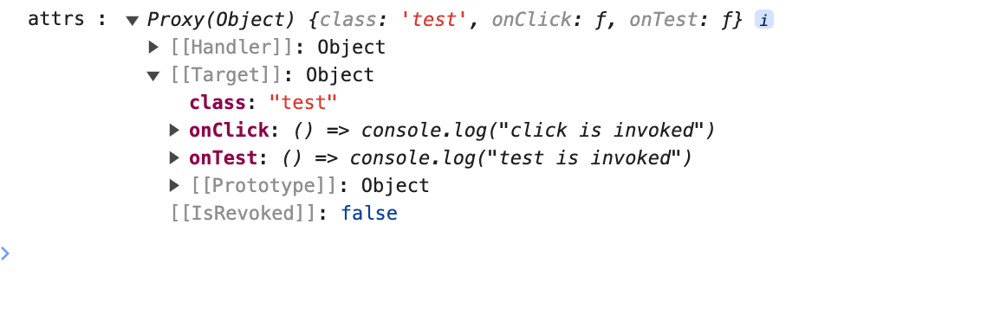
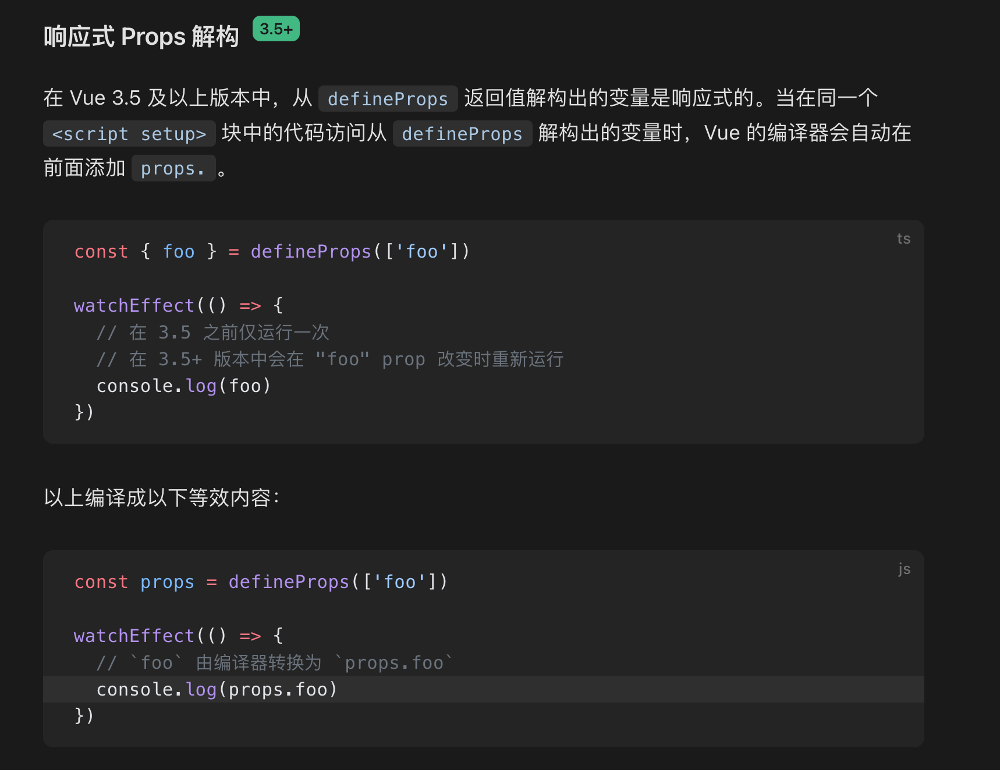
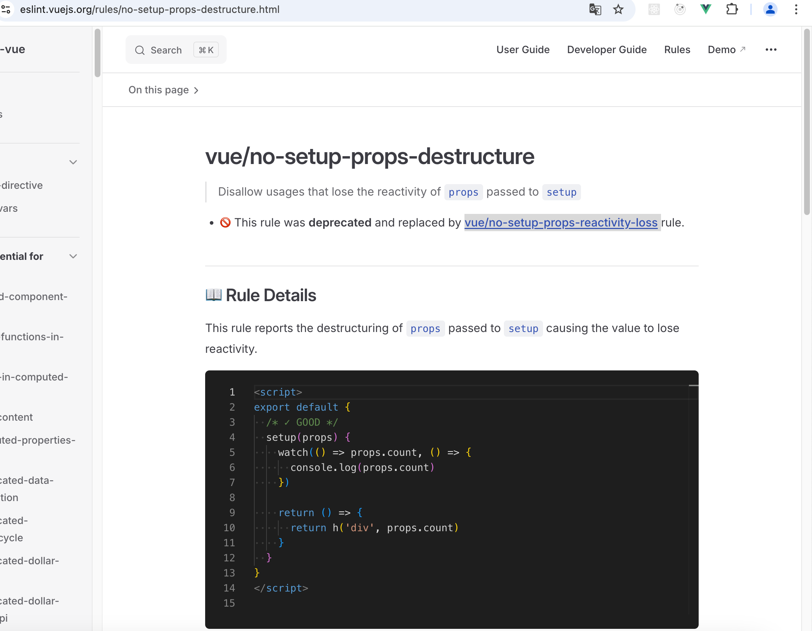

## vue完整版和运行时版(非完整版)选择

最佳实践：总是使用非完整版，然后配合打包工具的vue-loader编译vue文件

完整版带有编译器，原则上是将不编译的.vue代码放到浏览器里编译，但一般不会这样做，在浏览器编译影响性能，一般还是使用vue-loader先完成编译成js，即将模板转换成render函数。

或者只写render函数，就不需要vue-loader编译。

运行时版没有编译器，所以必须先使用vue-loader先完成编译，再去浏览器运行。运行时版本的vue体积更小，缺点是无法使用部分编译器的api(如果必须使用，只能切换成完整版)。

https://zhidao.baidu.com/question/1894643341590049348.html

https://blog.csdn.net/Nicole99618/article/details/114063194

## Vue 单文件组件 CSS 功能

子组件的根元素使用 `scoped` 后，父组件的样式将不会渗透到子组件中。不过，子组件的根节点会同时被父组件的作用域样式和子组件的作用域样式影响。这样设计是为了让父组件可以从布局的角度出发，调整其子组件根元素的样式。

1.需要子组件添加根节点这条才成立

2.定义后的效果：会产生透传 attribute

module

使用module后正常的赋值会失效，必须要$style.blue

## defineEmits

组件可以显式地通过 [`defineEmits()`](https://cn.vuejs.org/api/sfc-script-setup.html#defineprops-defineemits) 宏来声明它要触发的事件

vue3默认给组件绑定的都是原生事件，默认传递给子组件的根节点，defineEmits可以设置某些父组件传入的事件为自定义事件。

如果子组件没有根节点，defineEmits又未设置某些传入的事件，则会有警告，子组件没有继承这些事件，对于这样的事件也无法被调用。

$emit在当前组件触发一个自定义事件，不管有没有根节点、有没有defineEmits设置事件都可以触发

父：

```html
<EmitTest
    @click="() => console.log('click is invoked')"
    @test="() => console.log('test is invoked')"
  />
```

子：

```vue
<template>
	<div @click="$emit('test')">EmitTestEmitTestEmitTest</div>
  <div @click="$emit('click')">new testexample</div>
</template>

<script setup lang="js">
const emit = defineEmits(['test','click'])
console.log('emit :', emit)
emit('test')
</script>

<style lang="scss" scoped></style>

```

vue2默认都是自定义事件，需要绑定原生事件，需要添加.native修饰符

```html
<base-input v-on:focus.native="onFocus"></base-input>
```

## attribute透传

> [!WARNING] 
>
> 该理解不合理仅做备份，请看[attribute透传解析](#resolve)
>

产生：

指未被组件内部定义的defineProp、defineEmits使用的组件上传入的attribute 或者 `v-on` 事件监听器（未defineEmits设置就会被当成子组件根节点的原生事件）

绑定：

对于这些透传的属性和事件如果子组件有根节点，透传的 attribute 就会绑定到根节点上，但这些attribute还是属于透传的

这些透传进来的 attribute 也可以直接用 `$attrs`访问并手动绑定到模板上，使得子组件继承

```html
<span>Fallthrough attribute: {{ $attrs }}</span>
```

```html
<div class="btn-wrapper"> 
  <button class="btn" v-bind="$attrs">Click Me</button>
</div>
```

若没有根节点、没有手动绑定$attrs的话子组件就无法继承透传attribute会报警告，这些属性也无法被使用

## $attrs

区别：

vue2$attrs和$listeners分别代表传入组件的属性和事件（不包含.native修饰的）

可以通过 `v-bind="$attrs"` 和v-on="$listeners"传入内部组件

父：

```html
<base-input v-on:focus="onFocus"></base-input>
```

子：

```js
Vue.component('base-input', {
  inheritAttrs: false,
  props: ['label', 'value'],
  computed: {
    inputListeners: function () {
      var vm = this
      // `Object.assign` 将所有的对象合并为一个新对象
      return Object.assign({},
        // 我们从父级添加所有的监听器
        this.$listeners,
        // 然后我们添加自定义监听器，
        // 或覆写一些监听器的行为
        {
          // 这里确保组件配合 `v-model` 的工作
          input: function (event) {
            vm.$emit('input', event.target.value)
          }
        }
      )
    }
  },
  template: `
    <label>
      {{ label }}
      <input
        v-bind="$attrs"
        v-bind:value="value"
        v-on="inputListeners"
      >
    </label>
  `
})
```

vue3$attrs包含了属性和事件

vue3$attrs可以使用useAttrs在js中访问

```js
import { useAttrs } from 'vue'

const attrs = useAttrs()
```



自动绑定后依然可以手动绑定$attrs

## 直接对defineProps解构使用时自动加上prop引用

目前vue@3.5以上版本已经支持，但是eslint-plugin-vue@7、8版本还是不行，通不过eslint校验。



报错：

 error  Destructuring the `props` will cause the value to lose reactivity  vue/no-setup-props-destructure

目前官方已经vue/no-setup-props-destructure替换为[vue/no-setup-props-reactivity-loss](https://eslint.vuejs.org/rules/no-setup-props-reactivity-loss) 



解决方案：

- 配置eslint-rules或者更新eslint-plugin-vue@latest即v9.17.0

其他

当然继续使用toRefs后进行结构也是可以的

## Vue3 ESLint报错‘defineProps‘ is not defined的解决方法

https://www.jb51.net/article/272859.htm

## defineExpose 

vue3父组件获取子组件实例和内部属性

https://juejin.cn/post/7031921830852034591

## attribute透传解析<a name="resolve"></a>

父组件传递给子组件props或`v-on` 事件监听器时，子组件有两个任务：

- 将传递过来的属性和监听器绑定到根元素上（必须）
- 声明自己接受的属性和自己拥有的事件（可选）

同时，子组件自己的接受属性和拥有事件**一旦被声明过**，将不会把父组件传递的属性和监听器包含进透传attribute。

如果子组件未声明，则父组件传递的这些属性和监听器就是**透传attribute**，必须要被绑定到子组件节点上。

- 对于单个根节点的子组件，会自动把这些属性和监听器绑定到根节点上
- 对于多个根节点的子组件，需要手动显示地把这些属性和事件绑定到子组件节点上。
- 两种组件都支持手动绑定透传attribute

```html
 <!-- 父组件 -->
<template>
	<AttributeTest
    name="2121"
    @click="
      () => {
        console.log('click回调触发了')
      }
    "
  />
  </template>
```

```vue
<!-- 子组件 -->
<template>
  <div>
    <div>AttributeTest1</div>
    <div>AttributeTest2</div>
  </div>
</template>

<script setup lang="ts">
defineProps(['name'])
defineEmits(['click'])
</script>
```

以上代码，点击子组件不会触发click回调，因为click事件被子组件声明了，不会自动绑定到子组件根节点上，需要子组件内部自己触发。

流程：

父组件传递属性和监听器->inheritAttrs设置允许透传->未被子组件定义->形成透传attribute->绑定透传attribute到节点

### inheritAttrs

设置是否允许透传的属性被自动绑定到根节点上（透传attr还是会存在）

### $emit

$emit(event)

只是触发一下父组件中该子组件上设置的监听器的回调函数，既不能声明事件，也不能绑定$attrs

无论是在 Vue 2 还是 Vue 3 中，$emit 的基本工作原理都是相似的。当你在子组件中调用 $emit 函数时，Vue 会查找该组件的父组件，并查看父组件是否监听了你触发的事件。如果父组件监听了该事件，那么它就会调用与该事件相关联的回调函数，并将你传递的数据作为参数传递给这个回调函数。

参考：

https://blog.csdn.net/weixin_47772925/article/details/136439133

> [!NOTE] 
>
> 概念辨析：
>
> 事件：是元素或组件自身拥有的东西，通过自身触发或者其他行为比如点击等触发，事件不是父组件传递过来的，也不是父组件触发的。
>
> 监听器：父组件对子组件或元素的事件进行监听，并定义一个回调函数当事件被触发时调用，所以所谓事件绑定其实是绑定一个回调函数到元素的事件上，而不是绑定一个事件到元素上。原生只能进行监听，但vue3中父组件可以把监听器传递给子组件的节点。
>
> click与onclick：click是事件名称；onclick是监听器，表示对该事件进行监听。原生中是onclick、vue模板中是@click、jsx中是onClick

注意：

1.如果使用tsx，需要使用props接收监听器属性，手动将监听器绑定到根节点上；或者也可以声明成自己的事件，使用emit方法进行手动调用。不然依靠根节点自动绑定的话子组件就未声明对应的属性或事件，组件使用时添加事件监听器会有类型问题。

2.jsx、tsx如果使用空节点，即使他们肯定是单节点组件，透传attr也会无法自动绑定

## setup函数中使用await

会导致setup函数必须添加async，导致其返回一个promise,vue默认无法解析promise为组件，解决方法是在该组件外添加一个Suspence标签，表示该组件为异步组件，这样就能解析promise了。

一般不要在setup中使用await，如果需要进行异步操作，可以放到生命周期钩子中。
