## 什么是vue

渐进式框架：可以按需逐步添加需要的功能。vue的核心库只关注视图层

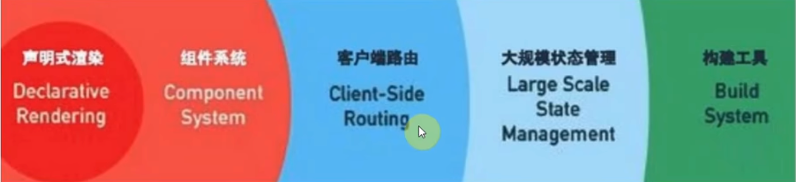

### 1.声明式渲染（核心特点）

Vue.js的声明式渲染是指通过简洁的模板语法来描述页面的结构和数据绑定关系，而不需要直接操作DOM进行命令式编程。依赖于模板系统和响应式数据绑定机制（即mvvm模式）

体现在模板语法、命令、api

参考：

https://developer.aliyun.com/article/1410549

### 2.采用MVVM模式

绑定数据和视图，简化了MVC模式

### 3.采用虚拟dom

实现跨平台

减少操作dom的频率

采用diff算法进行更新

### 4.区分编译时和运行时

编译时将模板编译成render函数，运行时只需获取虚拟dom并渲染成真实dom，以此提升性能

### 5.组件化

高内聚低耦合

降低更新范围，只重新渲染变化的组件

## MVC

常用于后端、前后端不分离的情况，从数据库获取数据并渲染到页面上

- 控制层（control）：业务逻辑(在用户请求资源后调用service中的方法获取数据)
- 服务层（service) ：去调用model中的方法把数据查出来返回给页面
- 数据层/持久层（Model）：数据模型(model直接查数据库)
- 视图层（View）：应用的展示效果，各类UI组件

## MVVM

MVC应用到前端时需要操作dom写很多controller，使用MVVM将这些dom操作进行封装，将数据与视图绑定可以简化MVC

- 数据层（Model）：应用的数据及数据操作逻辑
- 视图层（View）：应用的展示效果，各类UI组件
- 业务逻辑层（ViewModel）：框架封装的核心，它负责将数据与视图关联起来

**理解ViewModel**

它的主要职责就是：

- 数据变化后更新视图
- 视图变化后更新数据

当然，它还有两个主要部分组成

- 监听器（Observer）：对所有数据的属性进行监听
- 解析器（Compiler）：对每个元素节点的指令进行扫描和解析,根据指令替换数据,以及绑定相应的更新函数

## SPA

### SPA与MPA对比

**spa**：单页面应用，由一个主页面和多个单页面片段组成，采用局部刷新，页面切换快。

默认打包后只有一个html页面，并提供一个挂载点，会在此页面中引入对应的js资源。切换页面时通过监听路由变化，渲染对应的页面。

属于客户端渲染（CSR）：浏览器请求获取html、js之后还需要解析获取虚拟dom，转换成真实dom。

seo优化难实现，首屏加载较慢：原因是浏览器请求返回的html里只有一个app节点，没有任何内容，无法seo优化。然后再请求js，浏览器解析后生成真实dom，这样白屏时间较长。

**mpa**：多页应用，由多个html页面组成，采用整页刷新，页面切换速度较慢。

属于服务端渲染SSR：服务端返回完整的html，数据既可以在客户端发送ajax请求获取，也可以在后端获取之后由服务端一并返回（服务端压力较大）。

|                 | 单页面应用（SPA）         | 多页面应用（MPA）                   |
| --------------- | ------------------------- | ----------------------------------- |
| 组成            | 一个主页面和多个页面片段  | 多个主页面                          |
| 刷新方式        | 局部刷新                  | 整页刷新                            |
| url模式         | 哈希模式                  | 历史模式                            |
| SEO搜索引擎优化 | 难实现，可使用SSR方式改善 | 容易实现                            |
| 数据传递        | 容易                      | 通过url、cookie、localStorage等传递 |
| 页面切换        | 速度快，用户体验良好      | 切换加载资源，速度慢，用户体验差    |
| 维护成本        | 相对容易                  | 相对复杂                            |

### 解决首屏加载速度慢

原因：

1.网络延时

2.资源文件过大

3.资源重复发送请求加载

4.加载脚本时渲染内容堵塞

解决：

1.减小入口文件体积：路由懒加载

2.静态资源本地缓存

前端：使用localstorage

后端：

- 采用`HTTP`缓存，设置`Cache-Control`，`Last-Modified`，`Etag`等响应头
- 采用`Service Worker`离线缓存

3.UI框架按需加载

4.组件重复打包

进行代码拆分:

假设`A.js`文件是一个常用的库，现在有多个路由使用了`A.js`文件，这就造成了重复下载

解决方案：在`webpack`的`config`文件中，修改`CommonsChunkPlugin`的配置（webpack5是SplitChunksPlugin，开箱即用）

```
minChunks: 3
```

`minChunks`为3表示会把使用3次及以上的包抽离出来，放进公共依赖文件，避免了重复加载组件

5.压缩图片

对于所有的图片资源，我们可以进行适当的压缩

对页面上使用到的`icon`，可以使用在线字体图标，或者雪碧图，将众多小图标合并到同一张图上，用以减轻`http`请求压力。

6.开启Gzip压缩

使用compression-webpack-plugin插件，配置webpack

```js
const CompressionPlugin = require('compression-webpack-plugin')

configureWebpack: (config) => {
        if (process.env.NODE_ENV === 'production') {
            // 为生产环境修改配置...
            config.mode = 'production'
            return {
                plugins: [new CompressionPlugin({
                    test: /\.js$|\.html$|\.css/, //匹配文件名
                    threshold: 10240, //对超过10k的数据进行压缩
                    deleteOriginalAssets: false //是否删除原文件
                })]
            }
        }
```

在服务器我们也要做相应的配置 如果发送请求的浏览器支持`gzip`，就发送给它`gzip`格式的文件 我的服务器是用`express`框架搭建的 只要安装一下`compression`就能使用

```js
const compression = require('compression')
app.use(compression())  // 在其他中间件使用之前调用
```

7.使用SSR

SSR（Server side ），也就是服务端渲染，组件或页面通过服务器生成html字符串，再发送到浏览器

首屏采用服务端渲染的方式，后续采用CSR

8.懒加载


### 面试题回答整理

1.使用路由懒加载（加载首页时只需要加载首页的路由组件文件，不使用懒加载的组件文件在首页路由访问时都会被加载，但是组件不会挂载，要访问组件路由才会开始挂载）、异步组件（使用按需加载），异步组件可以实现组件拆分异步加载，这两个配合使用webpack分包减少入口文件体积大小

2.骨架屏优化体验

3.抽出公共代码，splitChunks进行代码分割

开启splitChunks后，设置了懒加载的路由和异步加载的组件才会进行代码分割

不开启都不会分割，不分割之后路由还是可以懒加载，但对优化入口文件体积来说就失去了意义。不分割也可以使用异步组件，但是就无法减小入口文件体积了

4.静态资源（其中的打包好的js、css、html）缓存，采用http缓存、使用localstorage实现缓存资源

5.图片资源的压缩，雪碧图、对小图片进行base64减少http请求

6.打包开启gzip压缩处理，使用compression-webpack-plugin插件

7.静态资源使用CDN提速（终极手段，就近访问）

8.SSR服务端渲染（直接得到渲染好的html，不需要请求html后再请求js再对js解析）

## 模板渲染逻辑

### 挂载阶段

*extra：调用 `beforeMount:`钩子在挂载开始之前，Vue 会调用 `beforeMount` 钩子。这一阶段表示模板编译完成，即将开始将虚拟 DOM 挂载到真实 DOM 上。*

1.在编译打包时将模板编译成render函数，render函数返回一个虚拟dom树。

2.在浏览器运行时调用render函数生成虚拟dom树（虚拟 DOM 树是一个 JavaScript 对象树，每个节点称为 VNode，vNode由h函数生成）。

3.vue将虚拟dom转换成真实dom挂载到指定的dom元素上。

*extra：调用 `mounted` 钩子：挂载完成后，Vue 会调用 `mounted` 钩子。这一阶段表示组件已经挂载到 DOM 上，可以进行 DOM 操作和数据获取。*

### 更新阶段

1.组件数据发生变化，Vue检测到这些变化触发更新流程

*extra：调用 `beforeUpdate` 钩子在更新开始之前，Vue 会调用 `beforeUpdate` 钩子。这一阶段表示数据已经发生变化，即将开始重新渲染组件。*

2.调用之前编译好的渲染函数生成新的虚拟dom树

3.使用diff算法比较新旧虚拟dom树，找出需要更新的部分

4.将变化应用到真实dom上，完成dom更新。

*extra：调用 `updated` 钩子：更新完成后，Vue 会调用 `updated` 钩子。这一阶段表示组件已经重新渲染完成，可以进行 DOM 操作和数据获取。*

### 销毁阶段

*extra：调用 `beforeDestroy` 钩子在组件销毁之前，Vue 会调用 `beforeDestroy` 钩子。这一阶段表示组件即将被销毁，可以进行一些清理工作。*

1.销毁组件实例，移除事件监听器和子组件。

*extra：调用 `destroyed` 钩子：销毁完成后，Vue 会调用 `destroyed` 钩子。这一阶段表示组件已经完全销毁，不再可用*

参考：

https://blog.csdn.net/My_wife_QBL/article/details/140171606

## 虚拟DOM

优点：

1.Virtual DOM就是用js对象描述真实DOM。由于直接操作DOM性能较差，可将DOM操作转成**对象操作**，最终通过**diff算法比对差异**进行更新DOM

2.虚拟DOM不依赖真实平台环境也可以实现跨平台。

如何生成：

1.template编译为render函数

2.浏览器解析ja挂载dom过程中调用render函数返回的就是VDOM

3.后续的patch过程中进一步转化为真实dom

如何diff：

1.挂载结束后，会记录第一次生成的VDOM - oldVNode

2.当响应式数据发生变化时，再次重新调用组件的render函数，生成新的VDOM -newVNode

3.对oldVNode和newVNode做diff操作，将更改的部分应用到真实DOM上。这样可以做到最小量的dom操作，高效更新视图。

## Vue组件化

组成：

模板、属性、事件、插槽、生命周期

好处：

1.高内聚、可重用、可组合

2.vue组件降低更新范围，只重新渲染变化的组件

- vue每个组件都有一个渲染函数watcher（vue2）、effect（vue3）
- 数据是响应式的，就是说数据变化后会自动执行watcher或者effect
- 组件要合理划分，不拆分会要整个页面都更新，拆分过细会导致watcher、effect产生过多，调用过多也会造成性能浪费

> **既然vue通过数据劫持可以精准探测数据变化，为什么还需要dom进行diff检测差异？**
>
> 原本1.0是通过一个数据一个watcher探测数据变化，但是数据量大时性能较差
>
> vue内部设计原因：1.vue2.0之后是每个组件产生一个watcher，没有采用一个属性一个watcher（大量watcher产生浪费内存）。2.使用**组件级watcher**之后，属性变化会导致当前所属组件的整体更新，因此组件的更新就只能采用虚拟dom+diff算法比对进行优化。

## Vue3响应式原理(废弃)

### 什么是响应式

响应式是一个过程，存在触发者（数据），响应者（引用数据的函数）

当数据改变时，引用数据的函数(effect副作用函数)响应数据的改变，重新执行

### 核心原理

1.响应式是一个过程，存在触发者（数据），响应者（引用数据的函数）

2.当数据改变时，引用数据的函数响应数据的改变，重新执行

3.通过Proxy代理源数据

4.通过Proxy的自定义set操作自动执行副作用函数修改dom

概括：

Vue使用发布订阅模式，首次挂载时先进行**依赖收集**，收集依赖和对应的副作用函数；当数据改变时，触发副作用函数修改dom。

vue3使用Proxy代替Object.defineProperty进行**数据代理**，并对目标对象中的属性进行数据劫持：通过自定义的get操作进行依赖收集，通过set操作触发副作用函数修改dom

其他问题：

1）Proxy只会代理对象的第一层，那么Vue3又是怎样处理这个问题的呢？

　　判断当前Reflect.get的返回值是否为Object，如果是则再通过reactive方法做代理， 这样就实现了深度观测。

2）监测数组的时候可能触发多次get/set，那么如何防止触发多次呢？

　　我们可以判断key是否为当前被代理对象target自身属性，也可以判断旧值与新值是否相等，只有满足以上两个条件之一时，才有可能执行trigger。

## 响应式数据的理解/vue2和vue3响应式数据对比

### 什么是响应式数据

数据取值和修改值时都可以被观察到

### 如何进行数据劫持

vue2对象采用defineReactive，底层是通过**Object.defineProperty**劫持属性，添加get和set函数重写属性（只能对已经存在的属性进行劫持），多层对象通过递归实现；数组采用重写数组的方法来实现。

vue3采用**proxy**

**面试回答**：

vue2如何进行双向绑定？

Vue是采用**数据劫持**结合**发布者-订阅者模式**的方式

1. ‌**数据劫持**‌：Vue2在创建实例时，会通过[Object.defineProperty](https://www.baidu.com/s?rsv_dl=re_dqa_generate&sa=re_dqa_generate&wd=Object.defineProperty&rsv_pq=9f011bcd0003ceca&oq=vue2双向绑定原理问的是什么&rsv_t=f0052iyA9+OqEqIAx5TopJkW09tIP6SzeSAZD7iNQpnn7A607bf6xkdV/WsdHIm9f91GBw&tn=25017023_2_dg&ie=utf-8)方法对data选项中的所有属性进行数据劫持，将每个属性重写为getter和setter，这样当数据被访问或修改时，会触发相应的回调‌。
2. ‌**发布订阅模式**‌：Vue2使用数据劫持的方式创建[Observer](https://www.baidu.com/s?rsv_dl=re_dqa_generate&sa=re_dqa_generate&wd=Observer&rsv_pq=9f011bcd0003ceca&oq=vue2双向绑定原理问的是什么&rsv_t=f0052iyA9+OqEqIAx5TopJkW09tIP6SzeSAZD7iNQpnn7A607bf6xkdV/WsdHIm9f91GBw&tn=25017023_2_dg&ie=utf-8)（监听器）来监听所有数据的属性变化，并通过[Dep](https://www.baidu.com/s?rsv_dl=re_dqa_generate&sa=re_dqa_generate&wd=Dep&rsv_pq=9f011bcd0003ceca&oq=vue2双向绑定原理问的是什么&rsv_t=f0052iyA9+OqEqIAx5TopJkW09tIP6SzeSAZD7iNQpnn7A607bf6xkdV/WsdHIm9f91GBw&tn=25017023_2_dg&ie=utf-8)（消息订阅器）来收集订阅者Watcher。当数据变化时，Dep会通知所有订阅者（[Watcher](https://www.baidu.com/s?rsv_dl=re_dqa_generate&sa=re_dqa_generate&wd=Watcher&rsv_pq=9f011bcd0003ceca&oq=vue2双向绑定原理问的是什么&rsv_t=f0052iyA9+OqEqIAx5TopJkW09tIP6SzeSAZD7iNQpnn7A607bf6xkdV/WsdHIm9f91GBw&tn=25017023_2_dg&ie=utf-8)），从而更新视图‌。

### vue2缺陷

1.Object.defineProperty进行数据劫持**重写**属性添加getter和setter性能差

2.当新增和删除属性时无法监控变化（用的时候之前已经劫持过了，不会再劫持一次新的数据），需要通过$set、$delete实现

3.数组不采用Object.defineProperty劫持（原因是浪费性能，会对所有索引进行劫持），导致需要对数组进行单独处理

4.对ES6中新产生的Map和Set这些数据结构不支持。

使用注意点：

1.数据层级不要太深，不然重复递归影响性能

2.不要过多触发get函数，可以先把响应式数据的值赋值给一个新的值，用新值计算后再赋值给响应式数据

### Vue3优势

1.使用**代理**而不是重写属性，性能较好

2.代理整个对象，新增和删除属性也可以被检测到

3.支持数组的劫持

4.根数据不一定必须是对象，可以自己定义响应式数据

### vue2与vue3实现对比

Vue2：

```js
let obj = { name: 'test', age: 14, n: { num: 123 } }
function observer(data) {
  if (typeof data !== 'object' || data === null) {
    return data
  }

  for (const key in data) {
    defineReactive(data, key, data[key])
  }
}

function defineReactive(target, key, value) {
  //对属性值为对象的进行递归劫持
  observer(value)
  Object.defineProperty(target, key, {
    get() {
      //get时加到组件watcher
      return value
    },
    set(newValue) {
      //set时调用组件watcher
      if (value !== newValue) {
        value = newValue
        // 对新的值进行劫持
        observer(value)
      }
    }
  })
}

observer(obj)
obj.name = {
  inner: 21212
}
console.log('obj', obj)
```

Vue3：

```js
let obj = { name: 'test', age: 14, n: { num: 123 } }

let handler = {
  get(target, p, receiver) {
    let temp = target[p]
    if (typeof temp === 'object' && temp !== null) {
      return new Proxy(temp, handler)
    }
    return Reflect.get(target, p)
  },
  set(target, p, newValue, receiver) {
    Reflect.set(target, p, newValue)
  }
}

function reactive(target) {
  return new Proxy(target, handler)
}

let p = reactive(obj)
// 懒代理：不去访问对象不会进行代理
console.log('p :', p)
console.log(p.n)
```

属性劫持和代理的区别：

劫持针对的是属性，往对象中添加getter和setter重写属性，属性访问和变化可以检测到，但是新增属性和删除属性不会再写getter和setter，所以检测不到。

代理针对的是对象，代理对象的属性变化可以检测到，往代理对象新增和删除也可以

**面试回答**：

vue2是如何进行双向绑定的？

vue2采用数据劫持和采用发布-订阅模式实现双向绑定，采用Object.defineProperty劫持对象各个属性，重写getter和setter方法。当数据发生变化时触发setter发布消息给订阅者，触发更新函数实现视图更新。多层对象是通过**递归**来实现劫持。

vue2问题

1.使用数据劫持重写对象属性添加getter和setter性能较差

2.新增和删除属性无法监控到，需要通过$set和$delete实现

3.数组不使用数据劫持，会造成性能浪费，需要单独对数组进行处理

4.对ES6中的Map和Set不支持

vue3优化

1.使用proxy代理，性能较好

2.不需要重写数组方法，

3.新增和删除属性可以被监测到

4.可以代理Map和Set

## vue中如何检测数组的变化

### vue2处理

数组出于性能原因没有使用defineProperty对数组中每一项进行拦截，而是选择重写数组变异方法（push、shift、pop、splice、unshift、sort、reverse），从而劫持用户调用这些方法的操作，对视图进行更新。数组中如果是对象类型调用这些方法也会递归进行劫持。

> 变异方法是指能改变原数组的方法

由于只重写了方法劫持调用变异方法的操作而没有劫持每一项，所以数组的索引和长度直接变化是无法监控到的。

```js
data:{
	arr:[1,2,3]
}
//不是响应式，不会触发视图更新
arr[1] = '123'
arr.length = 2
//是响应式
this.$set(arr,1,'123')
arr.splice(1,1,'123')
```

需要通过vm.$set、vm.$delete实现，底层也是调用重写的方法，所以不如直接调用重写的splice方法。

```js
let obj = { name: 'test', age: 14, n: { num: 123 }, arr: [12, 'wqwq', 2132321] }

let newArrayProto = Object.create(Array.prototype)
let oldArrayProto = Array.prototype
// 函数劫持，对数组的变异方法进行重写,覆盖newArrayProto原型链上的方法
;['pop', 'push', 'shift', 'unshift', 'splice', 'sort', 'reverse'].forEach((method) => {
  newArrayProto[method] = function (...args) {
    // 调用老的数组方法
    console.log('调用了' + method)
    oldArrayProto[method].apply(this, args)
  }
})

function observer(data) {
  if (typeof data !== 'object' || data === null) {
    return data
  }
  //   Array.isArray(data)
  if (data instanceof Array) {
    // data.__proto__ = newArrayProto
    Object.setPrototypeOf(data, newArrayProto)
  } else {
    for (const key in data) {
      defineReactive(data, key, data[key])
    }
  }
}

function defineReactive(target, key, value) {
  observer(value)
  Object.defineProperty(target, key, {
    get() {
      return value
    },
    set(newValue) {
      if (value !== newValue) {
        value = newValue
        // 对新的值进行劫持
        observer(value)
      }
    }
  })
}

observer(obj)

obj.name = {
  inner: 21212
}
console.log('obj', obj)

console.log('obj.arr :', obj.arr)
obj.arr.unshift(123)
console.log('obj.arr :', obj.arr)

```

### vue3处理

无需另外处理，直接proxy处理，可以直接监测的索引和长度变化

## 依赖收集

概念：

让数据的所有属性记住自己依赖了哪个模板

**属性**收集自己的watcher依赖

数据中只有模板使用到的属性才会进行依赖收集，未使用到的属性不会收集。

```html
<div>{{ b.test }}</div>
<div>{{ b }}</div>
```

```js
let b = reactive({ test: 1111, newb: 'newb' }) as any
setTimeout(() => {
  b = 23333 //不重新渲染，因为b本身不会进行依赖收集，b被代理他下面的属性访问时才会进行依赖收集
  console.log('b :', b)
}, 1000)
```

### Vue2流程

1.模板编译成render

2.$mount组件挂载时render会放入新建的一个watcher，并把这个watcher放到全局（放到Dep.target）。

3.watcher新建时会**调用render函数**，render执行渲染出页面，此时就会取页面上的响应式数据，触发getter，**在getter中属性会记住自己的watcher（就是当前处于全局的watcher），属性就知道自己是处于哪个模板**。

> 属性如何记住自己的watcher：
>
> 响应式数据会创建一个dep属性，会调用dep.depend方法记住上面说的放在全局的这个watcher
>
> 属性和watcher的对应关系：
>
> 一个属性可能在多个组件中使用（vuex数据），所以一个数据可能记住多个watcher。同时一个watcher里会有多个属性。所以是多对多的关系。

4.属性更新时，就可以找到自己的watcher，调用里面的render重新渲染。

> 属性如何找到自己的watcher：
>
> 属性变化时会根据dep属性调用dep.notify去通知自己的watcher重新调用render

vue2源码：https://github1s.com/vuejs/vue/blob/main/src/platforms/web/runtime/index.ts#L41

### vue3流程

- 通过map结构将属性和effect映射
- effect本身是一个列表，一个数据可能对应多个effect

## Vue的生命周期

### vue2生命周期

beforeCreate

组件初始化完成，props被解析后立即调用，data选项还未处理，拿不到data选项数据

使用场景：编写三方插件（如vuex、vueRouter）时，共享属性和方法做mixin操作

created

组件处理完所有与状态相关的选项后调用，响应式数据、计算属性、方法和侦听器被配置完成。但组件还未挂载，$el属性还不可用。

使用场景：服务端（不涉及dom渲染，不支持mounted钩子），可以调接口

beforeMount

组件挂载之前调用，还未创建dom节点

使用场景：使用较少

mounted

组件挂载之后调用，可以操作dom

使用场景：可以调接口，获取dom元素

beforeUpdate

组件即将因为响应式状态改变而更新dom树之前调用

使用场景：修改数据不会二次更新

updated

组件因为响应式状态改变而更新dom树之后调用

使用场景：使用较少，一般是组件更新完后做缓存操作（缓存组件信息）、监控组件更新完成

> 和nextTick区别：
>
> updated会在组件的任意 DOM 更新后被调用，这些更新可能是由不同的状态变更导致的，因为多个状态变更可以在同一个渲染周期中批量执行（考虑到性能因素）。如果你需要在某个特定的状态更改后访问更新后的 DOM，可以使用 [nextTick()](https://cn.vuejs.org/api/general.html#nexttick) 作为替代。
>

beforeUnmount/beforeDestroy

在组件实例被卸载之前调用

unmounted/destroyed

在组件实例被卸载之后调用，

使用场景：一般用于清理一些副作用，取消全局事件绑定，销毁定时器等，防止内存泄露

activated

仅针对 KeepAlive 包裹的组件。注册一个回调函数，当组件被插入到 DOM 中时调用。

deactivated

仅针对 KeepAlive 包裹的组件。注册一个回调函数，当组件从 DOM 中被移除时调用

### vue3生命周期

1.**vue3的选项式api生命周期和vue2相同**，除了两个destroy改成unmount，和另外新加的三个钩子

2.组合式api生命周期钩子如下：

​	setup组合式api入口钩子，替代onBeforeCreate和onCreated

​	onBeforeMount

​	onMounted

​	onBeforeUpdate

​	onUpdated

​	onBeforeUnmount

​	onUnmounted

​	onActivated

​	onDeactivated

参考

https://juejin.cn/post/7352075662453702694?searchId=20241007140835FDE0F7079CF74DC84961

### vue3与vue2生命周期对比

1.vue3生命周期将beforDestroy和destroyed更改为beforeUnMount和unMounted

2.vue3新提供了2个dev调试钩子，1个SSR生命钩子

3.vue3提供组合式api生命周期钩子，都是在生命周期前加on。另外vue3提供setup组合式API钩子作为组合式api入口，生命周期钩子可以在其中使用。注意setup API本身就代替了onBeforeCreate和onCreated钩子，所以没有这两个钩子。


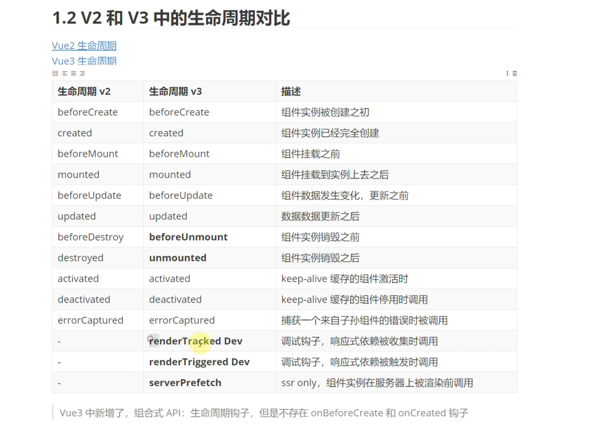

### 在哪个生命周期发请求

生命周期都是同步执行的，任何钩子都可以，但一般是在created和mounted，vue3组合式api只能在onMounted钩子中发送请求。

## v-model

v-model是一个语法糖，可以为表单组件（能修改的视图）做数据的双向绑定

**对于组件可以解析成一个value属性和一个input自定义事件**，组件内部需要在model选项中自定义对应的prop和event进行接收，并且可以在定义时给属性和事件修改名称。

**对于原生组件使用v-model，会解析出不同的属性和事件**，如input组件会生成value属性+input自定义事件，复选框生成checked+change。并且每种表单都有额外的处理逻辑，比如input会处理中文的输入问题。

### vue3新特性

对于组件：

1.Vue3使用v-model:name的方式可以对modelValue进行改名

用于自定义组件时，`v-model` prop 和事件默认名称已更改：

- prop：`value` -> `modelValue`；
- 事件：`input` -> `update:modelValue`；

2.Vue3支持多个数据双向绑定，使用v-model:a，v-model:b，Vue2不支持

3.Vue3自定义组件可以使用defineModel的返回值model代替modelValue的prop和update:modelValue自定义事件，model是一个ref

- 它的 `.value` 和父组件的 `v-model` 的值同步；
- 当它被子组件变更了，会触发父组件绑定的值一起更新

### .sync修饰符

实现vue2双向绑定多个数据（多个数据同步），解析成value+update:value

Vue3该语法被移除

## v-show与v-if

共同点：

- 当表达式为`true`的时候，都会占据页面的位置
- 当表达式都为`false`时，都不会占据页面位置

不同点：

控制手段：v-show隐藏是设置元素样式display:none使元素在页面上**不渲染**，不会占据位置，但dom元素还在。v-if隐藏是**直接删除dom元素**

编译过程：`v-if`切换有一个局部编译/卸载的过程，切换过程中合适地销毁和重建内部的事件监听和子组件，会触发子组件的生命周期；`v-show`只是简单的基于css切换，不会触发组件生命周期。

性能消耗：`v-if`有更高的切换消耗；`v-show`有更高的初始渲染消耗；

v-if比v-show优先级高

如何选择

v-if可以阻断内部代码执行，false不会执行内部逻辑

页面在第一次加载时确认后续不会频繁切换更改采用v-if，频繁切换改用v-show

## v-for与v-if

vue2v-for比v-if优先级高，vue3相反

1.vue2同时定义在一个元素上比较浪费性能且会发生报错，如果必须放在一个元素上（按条件渲染列表元素）可以提前通过计算属性对数组进行过滤代替v-if

2.vue3中v-if优先级较高，可以同时定义在一个元素上

但是如果按条件渲染列表元素会导致v-if无法访问到v-for中的item变量名，会发生报错

```html
<!-- 
 这会抛出一个错误，因为属性 todo 此时
 没有在该实例上定义
-->
<li v-for="todo in todos" v-if="!todo.isComplete">
  {{ todo.name }}
</li>
```

解决：

可以类似vue2对数组过滤，或者在外先包装一层 `<template>` 再在其上使用 `v-for` 可以解决这个问题 (这也更加明显易读)：

template

```html
<template v-for="todo in todos">
  <li v-if="!todo.isComplete">
    {{ todo.name }}
  </li>
</template>
```

## Vue.set/vm.$set实现

1.开发环境下、target未定义或者是原始类型则报错

2.如果是数组Vue.set(array,1,100)，会调用我们重写的splice方法（重写的方法可以更新视图）

所以说一般情况下更新数组可以直接用重写的方法即可

3.如果该属性就是对象本身的属性，则直接修改即可(本身就是劫持过的，直接修改会调用setter)

4.如果是Vue实例或根数据vm.$data时，报错（更新data无意义）

5.如果不是响应式的对象，直接添加属性（_\_ob__属性进行判断是否是响应式对象）

6.如果是其他情况（即响应式对象中添加新属性），直接使用defineReactive将其定义成响应式的，并通知视图更新（新属性此时会进行依赖收集）

新增属性时，可以考虑使用对象合并的方式（扩展运算符或者Object.assign都行），重新对对象赋值是响应式的，对象本身被劫持过。

```js
this.obj = { ...this.obj, ...{ b: 111111 } }
```

源码：

https://github1s.com/vuejs/vue/blob/main/src/core/observer/index.ts

## computed和watch

**computed**具备缓存功能，第一次取值的时候才执行对应的方法，依赖不发生改变，后续取值不会重新执行对应的方法，不支持异步逻辑

**watch**监控值的变化，当值发生变化调用回调函数。

异步要注意竞态问题（竞争条件）：

watchvue3提供了cleanup清理函数，可用于屏蔽上一次的结果（修改上一次回调函数中的变量值clear）

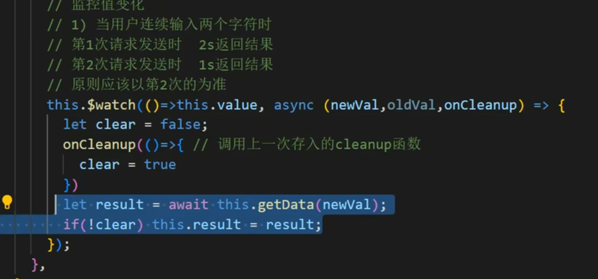

computed和watch都是基于watcher实现，下面标粗的都是使用watcher实现的逻辑。

> vue2watcher是创建时默认立即调用传入的函数expOrFn（除非设置lazy为true懒调用），vue3effect不是立即调用传入的fn

### computed原理

**概述逻辑**：

1.每个计算属性维护一个dirt属性，默认设置dirty:true

2.取值的时候dirty为true就执行方法，获取最新值缓存到this.value,并设置dirty为false

3.再次取值时dirty为false，就直接拿缓存的this.value值

4.当内部依赖（响应式）发生改变时，会设置dirty为true，触发更新，页面重新渲染，获取计算属性值时，发现dirty为true，重新进行计算属性值。

Vue2源码：https://github1s.com/vuejs/vue/blob/main/src/core/instance/state.ts

**vue2源码逻辑**：

> 思考：
>
> 计算属性依赖计算属性watcher，内部数据依赖计算属性watcher且依赖用了计算属性的模板的渲染watcher
>
> 依赖收集不一定非要使用属性的dep去关联全局的Dep.target中的watcher或用map把属性和全局的activeSub中的watcher关联起来，可以使用其他方式去对应，比如数组、数据的实例属性等，但都是访问响应式数据调用get方法时进行的

1.数据加载阶段

计算属性创建时会创建一个计算watcher并立即放到全局Dep.target，计算属性watcher的evaluate方法就是调用我们写的计算属性的函数。

通过Object.defineProperty定义vm上该计算属性的getter函数为调用watcher的evaluate方法，也就是会调用我们写的计算属性的函数。创建watcher时使用lazy:true,不立即调用我们传入的getter方法。

2.组件挂载阶段，如果计算属性在模板上使用了

**内部的依赖值（内部的响应式数据）会收集计算watcher（用于设置dirty值）和组件渲染watcher：**组件挂载时渲染watcher后也会立即放到全局，加入到全局数组中（数组中此时有计算属性watcher和组件渲染watcher），渲染页面时会访问到模板上的计算属性，访问时根据属性名找到自己的watcher，从而调用对应watcher的evaluate方法，也就是我们提供的方法，来访问内部的响应式数据，他们调用get方法通过自身的Dep对象收集这两个全局的watcher。

**计算属性被访问时会收集自己的计算属性watcher：**是通过vm实例的_computedWatchers数组保存每个计算属性的watcher，通过计算属性名关联属性和watcher。读取计算属性时就会触发对应watcher的evalute函数。

补充：以上两个阶段中，创建计算属性时watcher上的dirty初始化为true，组件挂载初次渲染页面取值计算属性dirty为true触发evaluate方法求值缓存到this.value，并设置dirty为false。再次获取计算属性时，还是会触发evaluate方法，由于此时dirty为false，直接使用缓存值。

3.组件更新阶段

内部依赖值更新后会通过收集的计算属性watcher的update方法设置dirty为true，然后调用渲染watcher的render函数重新渲染页面，会导致重新取值计算属性，触发计算属性getter，此时dirty为true，调用对应的计算属性watcher的evaluate函数（我们提供的方法）获取新的值。

**vue3源码逻辑**不同之处：

1.**计算属性内的依赖不会收集渲染effect，而是会收集计算属性effect，计算属性effect再去收集用了计算属性的模板的渲染effect**，**计算属性会收集自己的计算属性effect**

**面试回答总结**：

vue2中计算属性中的响应式数据变化了通知计算属性watcher和渲染watcher

vue3中计算属性中的响应式数据变化了通知计算属性effect，计算属性effect通知渲染effect

### watch原理

**概述逻辑**：

1.**新建一个effect，并放入数据getter函数、回调函数cb**

2.创建watch时调用一次watcher中的getter函数获取oldvalue，并进行依赖收集：响应式数据get触发，数据依赖这个effect。

3.响应式数据变化时再次调用watcher中的getter函数获取newvalue，并调用watcher中的cb，传入odlvalue、newvalue。

**vue2源码逻辑**：

Vue2源码：https://github1s.com/vuejs/vue/blob/main/src/core/instance/state.ts#L68

每个watch会有一个getter和一个回调cb，创建一个watcher传入这两个函数，创建watcher时会运行get函数将自己放到全局Dep.target，并调用getter。getter中的响应式数据会进行依赖收集，收集这个全局Dep.target中的watcher。每次数据变化都会调用watcher中update，update会调用run，最终就会调用cb函数。

**vue3源码逻辑**：

Vue3源码：https://github1s.com/vuejs/core/blob/main/packages/reactivity/src/watch.ts

1.获取数据源和cb回调函数：watch传入一个source和cb函数，source可以是响应式数据或一个getter函数（getter函数每次调用返回一个数据源新值），如果是响应式对象，也会将其转化为一个getter函数，返回source.value作为数据源

2.**新建一个effect**并将getter函数传入构造函数，如果调用effect.run方法，将会调用getter函数，返回数据源最新的值。调用run方法也会把当前创建的这个effect放到全局activeSub。新建一个job函数赋值给effect.scheduler，job函数中有efftct.run方法的调用、cb回调函数的调用。

3.初始化watch时运行一次effect.run方法，其中调用了getter函数获取oldValue，获取响应式数据的值会触发其get方法，get中触发track方法，track将响应式对象和全局的这个effect关联到一个Map中（这个map的结构是：target->放多个effect的Map）。这个过程就是effect对这个getter方法返回的数据源中的响应式对象进行了**依赖收集**。

4.当响应式数据发生变化时，会触发响应式数据的set方法，set方法调用trigger方法，trigger方法会从Map中获取响应式数据对应的effect Map，遍历执行所有effect的effect.trigger函数。调用effect.trigger函数，trigger函数调用effect.scheduler即job。job函数会调用effect.run方法获取newValue，调用cb函数，并将newValue和之前的oldValue一起赋值给cb函数

## ref和reactive区别

reactive处理代理对象，通过代理对象进行数据劫持，底层是new Proxy()

源码：https://github1s.com/vuejs/core/blob/main/packages/reactivity/src/reactive.ts#L92-L93

ref处理原始类型，会将原始数据类型包装成RefImpl对象，然后采用的是Object.defineProperty()对这个对象进行数据劫持（其实使用的是类的getter和setter函数）

源码：https://github1s.com/vuejs/core/blob/main/packages/reactivity/src/ref.ts#L108-L109

ref如果包对象，底层采用reactive处理对象

reactive对象包ref，如果reactive对象不是数组，则底层会自动对ref进行解包操作（自动ref.value）

```ts
const a = ref(123)
console.log('a._value :', a.value)

// reactive处理就是创建一个代理对象
const b = reactive({ test: 1111 })
console.log('b :', b)

// ref中包普通对象，对象自动转成reactive
const obj = ref({ foo: 'qwqqw' })
console.log('obj :', obj)

// ref中包reactive，对象自动转成reactive，但已经是reactive了不处理
const rct = reactive({ bar: 12112 })
const obj2 = ref(rct)
console.log('obj2 :', obj2.value.bar)

// reactive中包ref,reactive代理了ref，代理对象取value就是取的ref的value，拿到的是数字
const refv = ref(123)
const obj3 = reactive(refv)
console.log('obj3 :', obj3.value)

// reactive中包ref，读取属性时如果判断属性值是ref，会自动解包
//https://github1s.com/vuejs/core/blob/main/packages/reactivity/src/baseHandlers.ts#L120-L121
const refv2 = ref(123)
const obj4 = reactive({ age: refv2 })
console.log('obj4 :', obj4)

// reactive如果是数组,取索引值判断是ref也不解包
const obj5 = reactive<any>([1, '2112', refv2])
console.log('obj5 :', obj5)
console.log(obj5[2].value)
```

## watch和watchEffect区别

使用：

需要自动追踪多个响应式数据且不需要额外操作适合使用watchEffect，需要额外的回调cb进行其他操作使用watch

注意：

watch如果传入一个reactive处理的对象，对象内部的所有层级属性都会绑定effect（使用了reactiveGetter方法进行了所有属性的遍历），但是对象本身不会绑定，所以如果对象重新赋值无法触发cb

```js
let date = reactive<any>({ foo: 12121 })
watch(date, () => {
  console.log('invoke cb')//不会打印
})

setTimeout(() => {
  date = 1111
})
```

下面的写法也不会打印，调用getter之后访问的是date，不是内部的属性，不会进行依赖收集。因为对象代理之后是访问对象内部的属性时添加操作逻辑。

```typescript
let date = reactive<any>({ foo: 12121 })
watch(
  () => date,
  () => {
    console.log('invoke cb')//不会打印
  }
)

setTimeout(() => {
  date.foo = 22323
  date = 2333
})
```

下面的写法只有date的foo属性会进行依赖收集

```ts
let date = reactive<any>({ foo: 12121, myprop: '1211212'  })
watch(
  () => date.foo,
  () => {
    console.log('invoke cb')
  }
)

setTimeout(() => {
  date.foo = 22323//打印
  date.myprop = '12112'//不打印
})
```

原理：

watchEffect立即运行一个getter函数，然后追踪它内部的依赖（内部的响应式数据），并进行依赖收集关联这些数据和当前ReactiveEffect中的schedule，当这些依赖改变时运行schedule，schedule内部会重新运行getter函数。

watch第一个是getter，第二个是用户回调cb，先运行getter返回内部的响应式数据，该数据进行依赖收集关联这个响应式数据和当前ReactiveEffect中的schedule，当这些依赖改变时运行schedule，schedule内部会运行getter和cb，两次运行getter获取旧址和新值，传给cb。

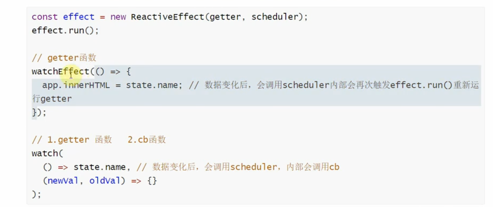


## 总结篇: vue发布订阅模式

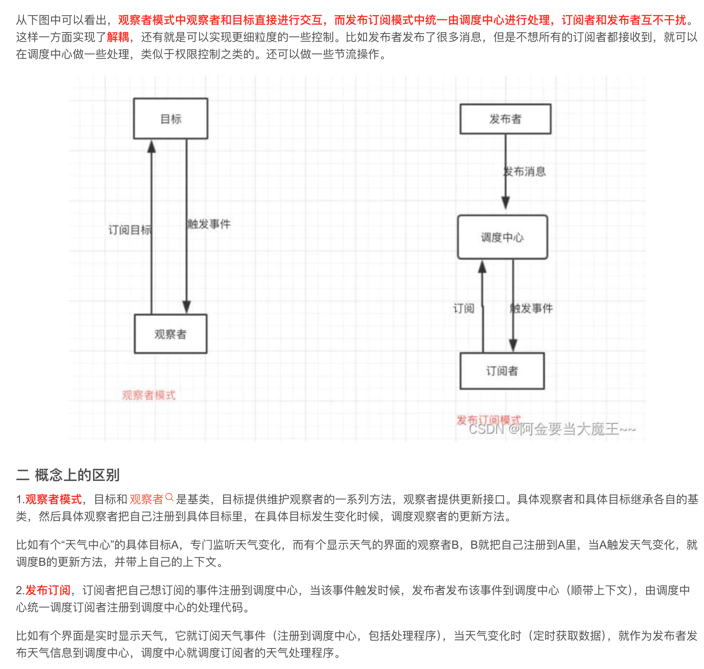

**响应式数据**来自数据劫持或者代理，watcher和effect来自**模板编译**

响应式数据是发布者，watcher和effect是订阅者，dep或map是调度中心。

watcher和effect种类：

- 渲染watcher、渲染effect
- 计算属性watcher、响应式effect（ReactiveEffect）
- 用户watcher

## template 到 render 的过程(编译时模板编译过程)

html转换为js

1.template转成**ast语法树**（抽象语法树：用来描述html），通过 parserHTML进行逐词翻译

2.**静态优化**ast语法树：对静态语法做静态标记 - 通过markUp diff来做优化，后续更新静态节点会跳过diff操作

3.将ast语法树转成render函数:遍历语法树通过字符串拼接重新**生成代码**（h函数调用代码），构造一个render函数返回生成的代码（这些代码是h函数的调用，调用结果是返回虚拟dom，所以相当于render函数返回了虚拟dom）

template->ast tree->code->render function

[vue2源码](https://github1s.com/vuejs/vue/blob/main/src/platforms/web/runtime-with-compiler.ts)

[ast编译网站](https://astexplorer.net/)

该编译过程比较消耗性能，一般编译过程是在构建工具中配合vue-loader进行。vue完整版带的编译器也可以编译，但不推荐在运行时使用（注意：vue编译器不是构建工具，只能在运行时使用）。

## new Vue的过程

main.js中使用new Vue

组件初始化+模板编译逻辑+模板渲染逻辑+响应式更新逻辑+生命周期调用

1、init events进行事件的初始化，init lifecycle初始化组件的父子关系$parent、$children、$root

调用beforeCreate钩子

2、init Injections、init Provide处理inject和provide。intState初始化响应式数据（reactivity），响应式数据包括：data(对象数据劫持、数组方法重写)、computed、props、watch、method

调用created钩子

3、判断用户是否传递**el属性**，如果传递了vm就自动调用$mount方法进行挂载，如果没传递需要用户自己手动调用vm.$mount进行挂载；开始挂载时判断用户是否传入**template选项**，如果传入就编译template为render函数（三部曲过程见模板编译过程），未传入就使用el的outerHTML（即div id=app节点本身加上其中的内容）作为模板转换为render函数。也可以直接传入一个render函数。如果使用的是运行时vue，只能传render函数，如果使用完整版vue，可以传模板。

对于其他导入的vue单文件组件，会由vue-loader统一把模板编译成render函数。

调用beforeMount钩子

4、调用render函数，将返回的VDOM渲染成真实dom放到页面的挂载节点上（通过 vm._update中先执行 vm.\_\_patch\_\_ 去把 VNode 转换成真正的 DOM 节点，再挂载到vm.$el上）。创建一个watcher，将以上渲染逻辑（封装成updateComponent）传入watcher，并对响应式数据添加dep属性进行依赖收集记住对应的这个watcher。

调用mounted钩子

5、后续数据变化触发视图更新，进行重新挂载时调用数据对应的watcher，即再次调用updateComponent（此时使用diff算法比较虚拟dom，找到差异点进行更新），

更新前会触发beforUpdate钩子，更新后触发updated钩子。这两个钩子都是传入了watcher，由watcher进行调用。

6、用户调用vm.$destroy时，会移除父组件下的当前子组件，移除该组件的响应式数据、事件。

销毁前调用beforeDestroy钩子，销毁后调用destroyed钩子。

[Vue2源码](https://github1s.com/vuejs/vue/blob/main/src/core/instance/index.ts)


## diff算法

虚拟dom可以看做描述真实dom的蓝图

一开始渲染，是根据虚拟dom创建了一套真实dom，然后将真实dom挂载到节点。

更新时再次调用render函数拿到了一套新的虚拟dom，我们不是直接根据这套新的虚拟dom去创建一套新的真实dom，而是尽可能去比较复用已经有的老的真实dom的节点，去调整位置，没有需要的节点的时候再创建新的真实dom节点，删除已有的不再需要的dom节点。

算法过程：

1.diff算法是比较两个虚拟树的差异，采用深度优先、同级比较的方式。

2.对两个节点的tag和key进行比较（调用sameVnode比较）：如果两个节点不相同，真实dom上就删除老节点，创建新的dom节点；如果是相同节点，比较两个节点的差异，包括属性和事件等。

3.比较完当前节点之后，如果两个节点相同，再去比较子节点（patchVnode）。

- 新节点是否是文本节点，如果是，则直接更新`dom`的文本内容为新节点的文本内容
  如果新节点不是文本节点：

- 新的有子节点，老的没有子节点，创建新的dom节点添加进父节点

- 新的没有子节点，老的有子节点，把不需要的老的dom节点删除

- 两方都有子节点且不完全相同（调用updateChildren处理子节点）：

​		1.vue2采用优化策略：进行头头，尾尾，头尾，尾头比较，比较一致后对真实dom进行移动调		整。

​		乱序时将老的创建为一个映射表，新的在这个映射表里找看看现有真实dom节点是否可以复		用，可以复用也进行移动即可，少的新增，多的删除。

​		每次复用移动之前先使用patchVnode递归比较这两个新旧虚拟节点的子节点。

​		2.vue3采用最长递增子序列进一步优化

[Vue2源码](https://github1s.com/vuejs/vue/blob/main/src/core/vdom/patch.ts#L533)

[源码解读](https://github.com/febobo/web-interview/issues/24)

面试回答：

diff算法过程？

1.diff算法采用同级比较的方式

2.先比较新老节点是否相同，如果不同就删除旧节点创建新节点

3.如果相同再比较新老节点的子节点，如果新节点没有子节点，老节点有子节点，就把子节点删除。如果新节点有子节点，老节点没有子节点，就创建新的节点。

4.如果双方都有子节点，就进行递归遍历比较和更新子节点

## key的作用

> 注意：创建dom节点的开销>更新dom节点的开销>移动dom节点的开销
>
> diff算法：尽可能复用dom本身去选择去更新，而不去移动dom

diff算法对比新旧vnode，会尽可能就地修改/复用相同类型的元素，但是这种算法可能会导致一些问题，需要使用key去决定到底是修改还是复用元素，还是直接创建新元素。

比如两个input切换时，仅仅是type属性不同，如果不使用key，切换时会将原来的input dom元素直接修改type属性，而用户输入的value值相同。使用了key可以销毁原来的input，生成一个新的input。

不传key默认key是undefined

key作用：

1.diff算法中通过key判断两个节点是否是相同节点，如果是相同节点，则进行复用（samevnode方法中使用key和tag对比新旧vnode）

2.进行预期的dom更新：如渲染列表时，vue会采用就地更新的策略，如中间插入元素时，**会更改每个元素的值，并在末尾新建一个元素后插入**，有key时diff算法会复用已有元素，直接可以插入元素后移动列表原有的元素。

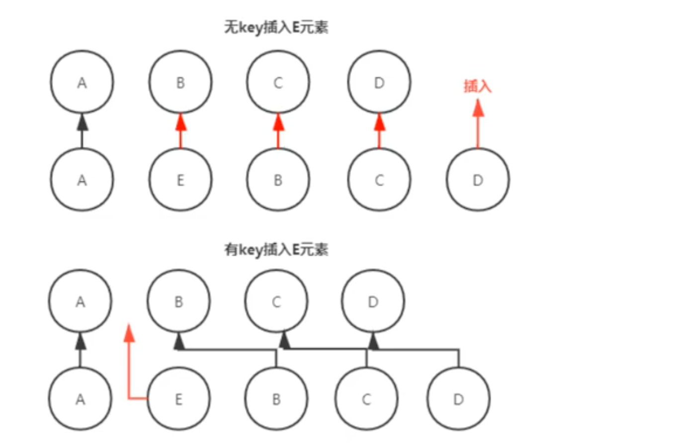


3.注意尽量不要使用index作为key

位置1插入一个元素导致列表index重新编号，此时新旧的node都会被认为对应是相同的元素（key和tag相同），1-4会直接进行修改操作然后新建一个index=5的e元素插入），而不是预期的节点复用

index ：0         1        2  3  4

div:   	a          b       c  d  e

index：0 1(新元素)    2  3  4  5（新建一个e元素插入）

div:	   a          f        b  c  d  e

**面试回答**：

key的作用/为什么必须要写key？

key可以在**diff算法中比较两个节点是否相同**。diff算法会尽量的复用原有节点，有时候这样更新会产生问题，需要使用key去决定diff算法中是否创建还是复用元素，所以**key可以保证进行预期的dom更新**（举例input、列表元素插入）。

为什么尽量不要使用index作为key？

diff算法列表会采用就地更新的策略，比较节点通过tag和key判断是否是相同节点。key使用index会在插入节点时判断插入位置和其后面的节点为相同的节点，而直接按照新的vnode的顺序往后更新内容，更新完之后再在尾部插入一个新节点。

这样会导致在列表变化时无法进行预期的节点复用，无法减少dom操作。

## Vue.use的作用（了解）

### 作用

安装Vue.js插件。插件如果是对象，必须提供install方法，如果是函数，会被作为install方法。vue.use会调用install方法，传入Vue以及vue.use的其他参数。

> 插件依赖vue
>
> 依赖vue指的是插件中通过import将vue引入
>
> 如果是通过其他方式传入的vue则不能说插件依赖vue，这样可以保证组件和外部的vue版本一致

### 插件的功能

1.添加全局组件、全局过滤器、全局组件

2.通过全局混入来添加一些组件选项

3.添加Vue实例方法，添加到Vue.prototype

### 应用

VueRouter插件、Vuex插件

## Vue2中vm和vc的区别、Vue.extend作用（了解）

### vm和vc的区别

vm是Vue的实例

VueComponent，是Vue.extend产生的，是Vue的子类。实例化之后就是vc，也就是每个组件对象。

### Vue.extend作用

每个组件创建的时候都会调用该方法。

Vue.extend(options)创建了VueComponent构造函数，赋值给Sub，并实现了Sub对Vue的继承。另外Sub上也添加了Vue的extend、mixin、use方法运行进一步扩展使用。Vue.extend最终返回了子类Sub。

用户调用Vue.extend(options)获取Sub构造函数后，new Sub()相当于new Vue(options)，构造函数会调用父类的Vue._init(options)进行实例的初始化和挂载，并且Sub子类对父类Vue进行了原型链继承。

### 应用

Vue.extend创建一个组件子类之后，可以手动将这个组件挂载到指定的节点上

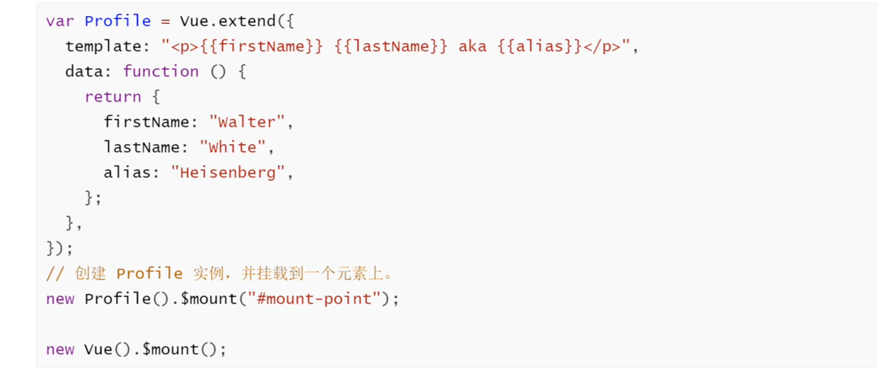

### 补充

Vue.component/directive/filter内部也是Vue.extend，第一个参数会自动使用给定的 `id` 设置组件的名称。第二个参数definition如果是对象，会被Vue.extend包裹返回一个组件构造函数。

> vue3可以使用render函数挂载组件到节点上

## data为什么必须是一个返回对象的函数

1.根实例对象（vm）的data既可以是对象也可以是函数

2.组件实例对象（vc）的data必须是函数

如果是对象，会导致不同组件实例对象之间**共用一个data**，产生**数据污染**。所以需要通过**工厂函数**使每个组件都返回**全新的data**作为组件的数据源。

因为options(内部存在data对象)是挂在组件构造函数Sub上的（类似类的静态属性），不同实例的data会共享这个对象

```js
Sub.options=options
```

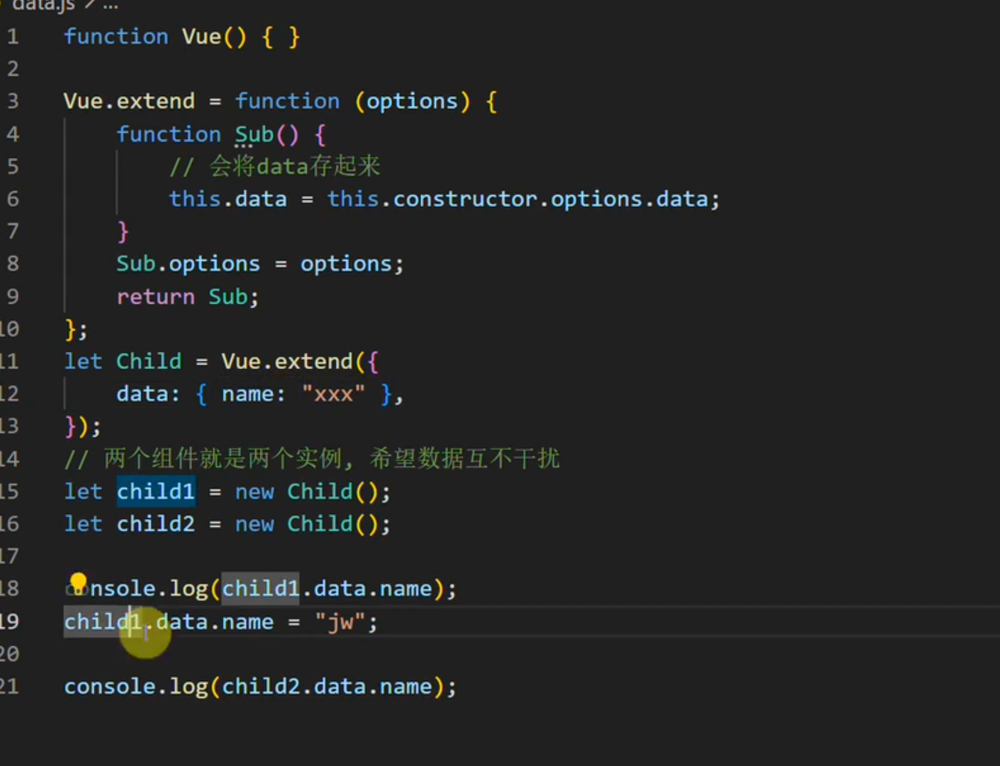

如果写成方法，每次调用Sub构造函数创建实例都会重新调用这个data方法，每次都返回不同的对象赋值给当前实例的data属性，所以不同实例取data时就不会共享同一个对象

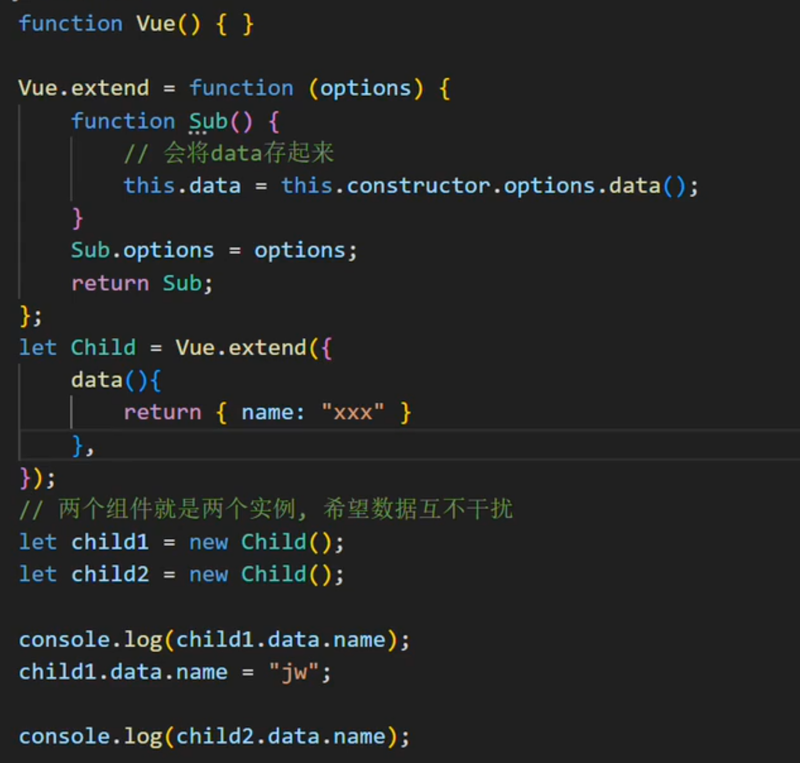

> Vue3使用CreateApp创建一个组件，组件中的data都会是一个函数

## v-once和v-memo

v-once只渲染元素和组件一次，之后重新渲染，元素/组件及其子节点将被视为静态内容并跳过。

渲染一次后将生成的dom存入缓存，之后只调用缓存

vue3中的v-memo通过依赖列表的方式控制页面渲染，依赖列表中的数据不变化，元素/组件及其子节点不发送重新渲染。依赖变化重新进行渲染。

内部实现类似watch，依赖变化后调用回调函数重新生成dom，不变化每次渲染都使用缓存dom节点。

## mixin

局部混入，全局混入。全局混入一般用于编写插件，局部混入用于复用逻辑。

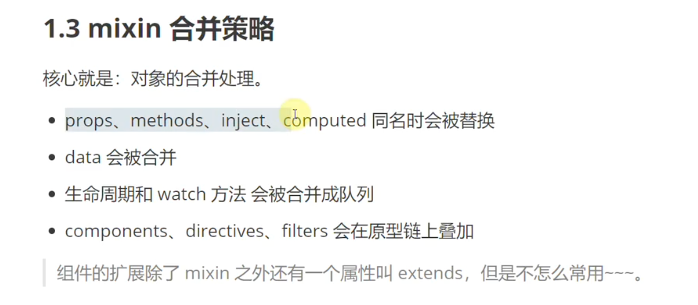

## slot

子组件使用slot可以进行占位，作用是定制化组件模板，父组件可以向子组件传入需要的内容。

默认插槽，插槽name为default

具名插槽，父组件放入插槽的内容已编译完成，子组件的插槽直接找父组件的对应name插槽，用来直接替换。

作用域插槽，父组件将还未完成编译的之后需要放入插槽的内容转化为一个函数，传入一个参数才会执行。子组件的插槽找到父组件对应name的插槽函数，传入需要的参数，函数返回用这个参数编译完成的内容，替换子组件的插槽位置。

**面试回答**:

Vue2：

普通插槽，实际dom**渲染在父级**，然后传入子级替换插槽位置。作用域插槽（拿到父级传入的函数后）实际dom**在子组件内部渲染**，然后替换插槽位置。

注意插槽渲染指的是子组件的slot被替换为实际的dom

vue3：

都是父组件把内部代码编译为函数传入子组件，子组件拿到之后**在子组件内部渲染**，替换插槽位置。

注意：使用template v-slot的都是编译成函数传入子组件，直接写div slot属性的都是直接父组件编译完成传递给子组件替换（slot属性2.6之后已废弃）

应用：

弹框组件、布局组件、表格组件、树组件、列表组件（自定义列表元素内容，子组件请求获取列表数据后通过slot的属性回传给父组件，父组件通过template的v-slot命令拿到数据后渲染出所有列表元素替换子组件中的slot）

## 递归组件(了解)

### 模板递归

组件需要写name选项

### jsx+render函数递归

较为直观

## 组件name选项作用(了解)

1.每个组件创建的时候都会调用Vue.extend方法，如果选项中有name属性，组件会把自己的构造函数（Sub）放到components数组中（将自己注册到组件中），组件便可以拿到自身进行递归调用。

```js
if (name) {
	Sub.options.components[name] = Sub
}
```

2.dev-tools方便查找和调试

3.keep-alive进行缓存配置（include、exclude）

4.方便注册组件

5.可以查找子组件

```js
$children.filter(item=>item.$options.name==='xxx')
```

## 组件是如何解析的

1.先根据name看看是不是自己，如果是就是递归组件

2.不是自己看看有没有该name的注册的组件

3.找全局是否有该name的注册组件

## 修饰符

简化逻辑，会编译成具体逻辑

1.表单修饰符：lazy、trim、number，限制表单输入

2.事件修饰符：stop、prevent、self、once、capture（事件捕获）、passive（滚动优化）、native（为组件绑定原生事件，vue3移除，默认将原生事件绑定到根元素上）

3.鼠标修饰符：left、right、middle

4.按钮修饰符 对keyCode处理

5.vue2.sync修饰符(vue3移除)

## 异步组件

### 概念

以一个工厂函数定义组件，异步调用函数解析组件定义

推荐异步组件和webpack的code-splitting配合使用，对异步组件进行分包

一般用于大组件的拆分（1.拆分出加载时间较长的组件，先加载整体页面，再加载局部的大组件，以此避免页面白屏加载时间过长2.当配合webpack分包时入口文件体积更小，加载会更快）、路由加载组件实现懒加载

### 用法

1.回调写法

2.promise写法

3.对象写法

### 原理

1.默认先同步渲染异步占位符节点

2.异步组件渲染完毕后调用$forceUpdate强制更新，渲染加载完毕后的组件到页面上

## nextTick

### 概念

1.Vue中更新视图是异步的（如果同步更新，用户多次更新数据都会多次驱动视图更新性能较差，异步更新可以保证多次更新视图最后只更新一次），异步更新的底层逻辑就是nextTick。

2.nextTick的回调函数可以获取更新后的DOM

3.多次调用nextTick会被合并（vue自己调用的nextTick会和用户定义的合并）

### 原理

vue2原理：

同一组件多次更新数据只会有一个watcher被加入queueWatcher队列，队列中不同组件的多个watcher执行最终也只会掉用一次nextTick，所以页面刷新只会调用一次nextTick。

用户可以多次调用nextTick，调用时会传入自定义回调。刷新页面的时候nextTick也会执行一次放入执行刷新页面的flash方法。执行刷新页面的flash方法和用户传入nextTick的自定义回调会合并到一个callback数组中。

虽然综上所述多次执行了nextTick，但最终nextTick内部也只会执行一次timeFunc方法（pending标识符控制），timeFunc执行的时候会异步依次执行callback数组中的方法，异步的手段会根据浏览器降级兼容。

所以概括就是批处理：

1.调用nextTick

2.依次放入用户回调，flash刷新方法到callback数组

3.异步按顺序调用callback数组中的方法（更新视图、用户获取dom）

vue3原理：

把传入的方法变成异步的

**面试题回答**：

vue2逻辑：回调放入异步队列，优雅降级

1.将 nextTick回调函数 和 数据更新后的页面渲染逻辑 按照执行属性依次放入callbacks中（重复的更新逻辑会去重）

2.根据浏览器兼容性进行降级（Promise、MutationObserver、setImmediate、setTimeout），将callbacks放入微任务或宏任务队列中准备执行

3，事件循环到了微任务或宏任务，执行callbacks中的回调

vue3逻辑：直接在同步代码之后异步执行

Vue3 中不在考虑 promise 的兼容性，所以mounted中本身会创建一个promise，nextTick回调放入promise.then。所以 nextTick 的实现原理就是 promise.then 方法，也就是放入微任务队列中异步执行，保证永远是在页面更新后执行。

### 扩展

event loop宏任务、微任务

参考：https://juejin.cn/post/6844904147804749832

## keep-alive

概念：

vue的内置组件，能在组件切换过程中缓存组件的实例（实例上有真实dom），组件不会销毁。组件重新激活时通过缓存的实例拿到之前渲染好的DOM进行复用，无需重新生成节点。

属性：

include、exclude、max(使用)

LRU缓存淘汰算法：

`keep-alive`的`max`属性，用于限制可以缓存多少组件实例，一旦这个数字达到了上限，在新实例被创建之前，已缓存组件中最久没有被访问的实例会被销毁掉；每次访问的实例都会被设置成最新的。

应用：

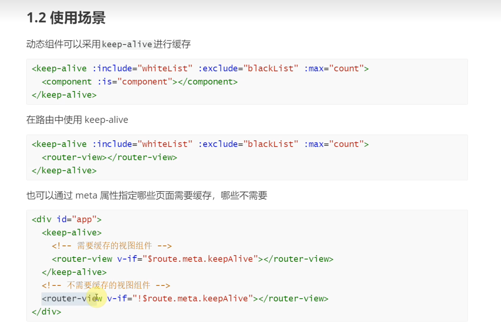

问题解决：

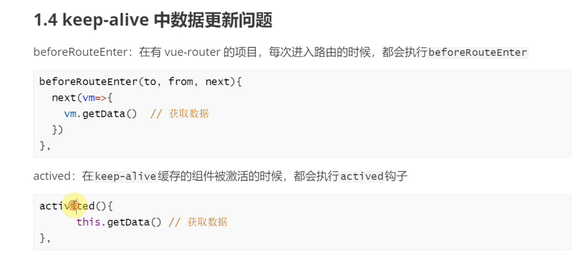

## 自定义指令

指令的目的在于复用操作dom的逻辑

### 常见指令编写

待补充

## vue设计模式

- 单例模式

  整个程序只有一个Vuex的store实例，分配给每个组件使用

- 工厂模式

  传入参数即可创建实例，createElement创建vnode

- 发布订阅模式（手动绑定，手动触发）

  事件绑定事件触发

  eventbus、provideinject

- 观察者模式（观察，自动触发）

  watcher&dep的关系

- 代理模式

  访问vm.a访问vm._data.a

## vue中的性能优化

- 数据层级不要过深，合理设置响应式数据
- 数据必须放data中，但不需要是响应式，使用Object.freeze
- 使用数据先取值将结果缓存，使用缓存操作后再赋值回去，不频繁取值触发getter
- 合理设置key属性，不要将index设置为key，希望元素更新可以设置key
- v-show和v-if的选取，v-if首次加载控制是否显示，v-show用于频繁切换
- 控制组件粒度，vue采用组件范围更新
- 采用函数式组件，vue2有大量渲染组件可用，vue3一般不用
- 采用异步组件，借助webpack分包的能力
- 采用keep-alive、v-once、v-memo缓存组件
- 数据过多分页，移动端虚拟滚动、时间分片渲染等策略

## vue项目解决跨域

跨域是浏览器同源策略导致的，是浏览器的默认行为（协议、主机名、端口不同）

注意服务端和服务端之间通信不会跨域

解决：

- CORS（Cross-origin Resource Sharing跨域资源共享）由服务端设置，允许指定的客户端访问服务器
- 构建工具设置反向代理（开发时webpack设置dev-proxy），使用Nginx设置反向代理（上线时）
- 使用WebSocket进行通信（部分接口去除跨域）
- 搭建BBF（Backend For Frontend）层解决跨域（前端访问BBF,BBF访问后端）

## vue项目封装axios

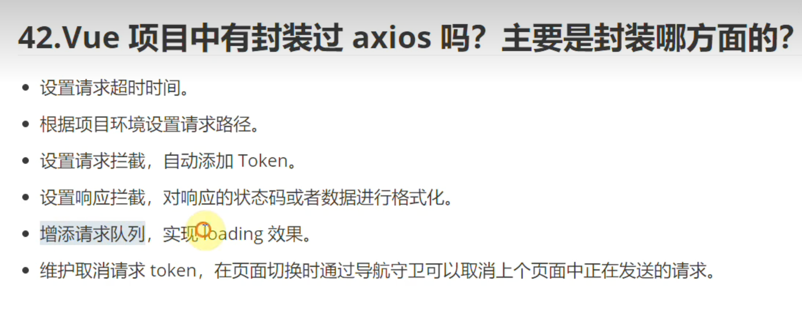

具体代码见ggzx

## vue项目权限管理

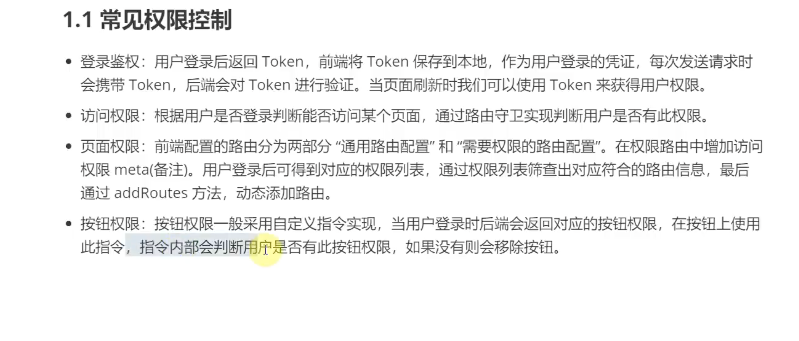

## vue3使用CompositionAPI优势

- vue2的OptionsAPI，用户提供的data、props、methods、computed、watch等属性，在复杂的逻辑会出现反复横跳的问题，组合式api可以把复杂逻辑更加聚合
- vue2中所有属性都是通过this访问，this有指向问题。组合式api没有this问题
- vue2很多未使用的方法或属性依旧会被打包，且所有全局API都在vue对象上公开。组合式api需要使用到某个钩子时才会手动引入，且引入之后会另外进行tree-shaking，使用到的才会打包。
- 组件逻辑共享问题，vue使用mixins实现组件之间的逻辑共享，但是会有数据来源不明确，命名冲突等问题。组合式api提取公共逻辑非常方便。

## vue3与vue2的区别

- vue3注重模块上的拆分，在vue2无法单独使用部分模块，需要引入完整的vuejs（例如只想使用响应式部分，但需要引入完整的vuejs）。vue3中的模块耦合度低，模块可以独立使用。
- vue2很多未使用的方法或属性依旧会被打包，且所有全局API都在vue对象上公开。vu3需要使用到某个钩子时才会手动引入，且引入之后会另外进行tree-shaking，使用到的才会打包。
- vue3允许自定义渲染器，扩展能力强。不会像vue2一样改写源码改造渲染方式，扩展更方便。
- vue2使用defineProperty进行数据劫持，需要对属性重写添加getter和setter，性能较差。当新增属性和删除属性时无法监控变化，需要通过$set和$delete实现。数组不采用defineProperty劫持（对索引劫持会造成性能浪费）需要对数组单独处理。vue3所有数据都采用proxy代理，性能得到提升
- Diff算法vue3进行了重写，进一步进行了优化
- vue3模板编译优化，采用PatchFlags优化动态节点，采用BlockTree进行靶向更新

## vue项目中的错误如何处理

1.errorCaptured钩子

组件捕获后代的错误，并向父组件上报，如果某一层组件的errorCaptured返回false会停止传播，最终传播到全局的config.errorHandler(需要被定义)

2.全局设置错误处理

如果组件渲染时出现运行错误，错误会被传递至全局的Vue.config.errorHandler配置函数

```js
app.config.errorHandler = (err, instance, info) => {
  // 处理错误，例如：报告给一个服务
}
```

3.接口异常处理

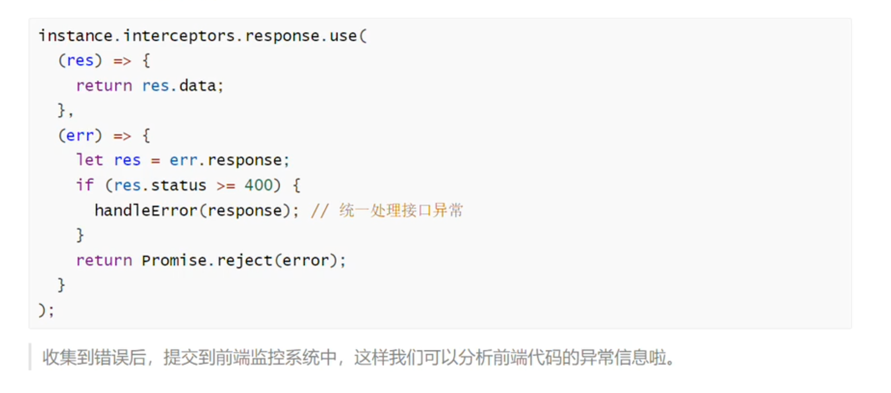

[Sentry前端监控](https://juejin.cn/post/7211401380769513531)

## vue3模板编译优化（了解）

待补充

## Vue3新特性

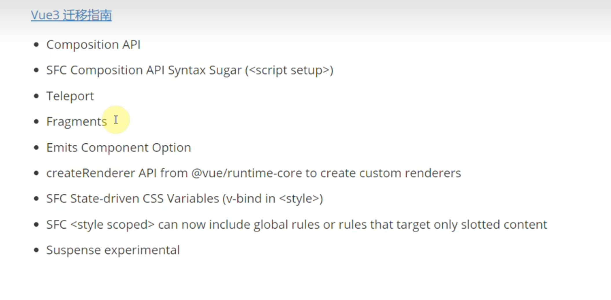

## vue-router路由守卫钩子

1. 导航被触发。
2. 在失活的组件里调用 `beforeRouteLeave` 守卫。
3. 调用全局的 `beforeEach` 守卫。
4. 在重用的组件里调用 `beforeRouteUpdate` 守卫(2.2+)。
5. 在路由配置里调用 `beforeEnter`。
6. 解析异步路由组件。
7. 在被激活的组件里调用 `beforeRouteEnter`。
8. 调用全局的 `beforeResolve` 守卫(2.5+)。
9. 导航被确认。
10. 调用全局的 `afterEach` 钩子。
11. 触发 DOM 更新。
12. 你用 `beforeRouteEnter` 守卫中传给 `next` 的回调函数，创建好的组件实例会作为回调函数的参数传入。

## vue-router的模式

### hash、history、abstract

- hash模式：前端锚点、兼容性好（高版本popstate、低版本hashchange）但不够美观。另外服务端无法获取前端锚点导致无法根据hash值渲染页面，不利于seo优化

​		原理：页面切换通过location.hash修改hash值，通过popstate/hashchange监控hash值的变化，变化时调用回调函数修改dom

- history模式：history.pushState api+popState事件美观。支持seo优化。

  原理：调用history.pushState切换路径，并重新渲染dom。监听popstate事件，当浏览器前进后退时触发回调函数渲染dom。

  > popState事件：可以监听hash值变化、浏览器前进后退（前进后退按钮、调用history的back、go、forward方法）。不会监听pushState和replaceState方法、a标签跳转。只能在同一页面上使用，不是同一页面无法监听。
  >
  > pushState、replaceState方法控制浏览器历史记录，修改当前url且不会刷新页面。必须使用http协议访问页面。

可以借助history模式实现hash模式，vue-router4就是使用history模式实现了两种模式，注意实现hash模式后特性就是hash模式的了，不再继承原来history的特性。vue-router3是分开实现的。

### hash和history切换和刷新的不同机制

hash切换或刷新页面是在当前页面上找锚点，不会向服务器发请求

history切换页面本身需要时向服务器发送请求整体页面，但vue-router利用pushState api+popState实现了无需 通过刷新来重新加载页面（不发送页面请求），而是在已经加载的单页面上解析js修改url的pathname、渲染dom。

但是history模式下页面刷新还是会发送请求出现404（使用了已经修改的url访问服务器，找不到资源），开发时可以使用wbpack history-fallback插件解决，部署到服务器需要使用nginx解决

> 对于vue-router，使用router-link相当于实现了上面所述的url跳转无需重新加载页面这样的a标签,即底层使用了**history.pushState**的a标签，而如果单独使用a标签会发生重新加载，底层使用了**location.href**。编程导航router.push底层也是使用了history.pushState。
>
> router-link和编程导航router.push还可以触发路由守卫钩子。

## Vue部署到服务器404解决

404原因：采用了history模式，刷新时服务端没有对应的资源。

解决方法：配置服务端当访问某个页面不存在时让服务端返回首页，解析引用的js根据路径找到对应的组件渲染。

[配置方法](https://router.vuejs.org/zh/guide/essentials/history-mode.html)

## vuex

### vuex刷新数据丢失解决

- 判断vuex中数据存不存在，不存在重新发送请求获取

- 使用持久化插件vuex-persistedstate，将数据存到缓存中

### mutation和action的区别

- 在action中处理异步逻辑，获取数据后将结果提交给mutation，mutation中修改state，mutation必须是同步的
- action中可以多次commit操作，action中也可以调用action
- 在非mutation中修改数据，严格模式下会发生异常
- dispatch会将action包装成promise，mutation没进行包装

## vuex的module

项目庞大，对状态进行划分

## vue3的tree-shaking

webpack项目打包时只要是引入的模块都会进行打包，比如`import { fn } from 'ModuleA'`会将整个ModuleA都打包到结果文件中。

如果开启了tree-shaking，那么只会将其中的fn方法打包进去。

vue3由于将全局API进行模块化拆分，支持了这样的按需引入方式，比如使用`import { ref } from 'vue'`。再配合打包工具开启tree-shaking，就不会将整个vue模块都进行打包，只打包按需引入的ref，减小了打包文件体积。

vue2不太支持按需引入，所有的方法都在Vue以及Vue的实例上，所以无法使用tree-shaking进行优化

参考：https://blog.csdn.net/weixin_42554191/article/details/141298319

## vue3组件通信方式

1.$attrs

2.props

3.emits

4.provide/inject

5.vuex/pinia

6.mitt

7.slot

8.v-model

9.expose/$parent(没有$children,可用provide/inject进行模拟)

