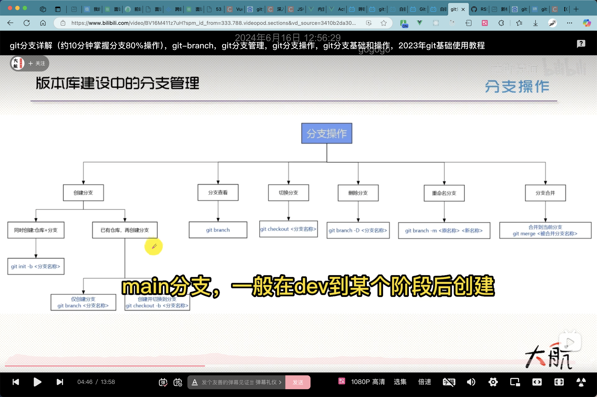

1.切换分支后修改提交了，原分支会和远端一样，修改暂存到了新分支



2.主分支合并其他分支冲突之后取消合并，要求其他分支拉取主分支内容后再合并。

不然主分支解决冲突后，其他分支还不是最新的。

不能污染主分支。

```
git merge --abort
```

3.可以在本地合并分支，也可以在远端提pr合并

4.git reset:本地git仓库回退版本

https://blog.csdn.net/m0_74910646/article/details/145002429

1.代码修改提交后，git reset HEAD^ --hard相当于git reset HEAD^ --mixed加上git checkout -- 文件

2.如果reset之后版本落后于远端，将无法提交，除非git push --force强制覆盖，会删除覆盖记录之后的提交记录，这样就能回退远端的版本

3.git push、git pull都会同步记录

