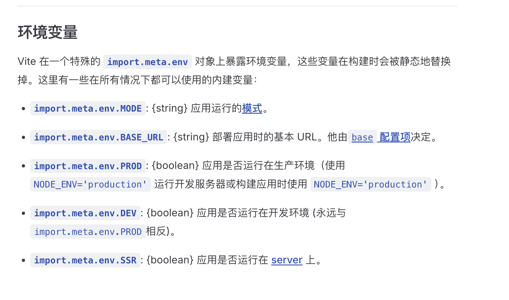

## webpack核心原理

1.初始化：开始构建，读取与合并配置文件和命令行的配置参数，加载Plugin，实例化Compiler实例

2.编译：执行对象的run方法开始编译，从入口文件开始，对Model使用对应的Loader翻译文件内容，使用acorn解析转换后的内容，输出对应的抽象语法树（AST）。分析AST找到该模块依赖的模块，进行递归处理，对依赖的每一个模块都进行翻译和生成AST，最终编译完所有模块，找到所有模块的依赖关系。

3.输出：对编译后的模块根据依赖关系生成一个个Chunk，再把每个Chunk转换成一个单独的文件输出到文件系统。

## Loader

### 概念

处理和加工打包过程中的资源文件

分类：

- 编译转换类
- 文件操作类
- 代码检查类

### 常见loader

- style-loader: 将css添加到DOM的内联样式标签style里

- css-loader :允许将css文件通过require的方式引入，并返回css代码

- less-loader: 处理less

- sass-loader: 处理sass

- postcss-loader: 用postcss来处理CSS

- autoprefixer-loader: 处理CSS3属性前缀，已被弃用，建议直接使用postcss

- file-loader: 分发文件到output目录并返回相对路径

- url-loader: 和file-loader类似，但是当文件小于设定的limit时可以返回一个Data Url，大于时调用file-loader

  当图片文件较小时，可以使用url-loader转换成base64，减少请求次数。

  当图片文件较大时，需要使用file-loader处理，直接将资源打包进输出目录dist，js文件中持有图片的地址，使用时进行资源请求。（如果处理成base64反而体积会更大）

  > Webpack5添加 4 种新的模块类型，来替换所有这些 loader

- html-minify-loader: 压缩HTML

- babel-loader :用babel来转换ES6文件到ES5

### 开发一个Loader

```js
const marked = require('marked');

module.exports = (source) => {
  // console.log('source :', source);
  const html = marked.parse(source);
  // console.log('html :', html);
  //   解析出的html存在换行，直接赋值给变量会报错，需要使用JSON.stringify将换行转成\n,该方法字符串转成字符串后会自带引号
  // console.log('JSON.stringify(html) :', JSON.stringify(html).charAt(0));
  // 1、返回导出字符串
  //   return `export default ${JSON.stringify(html)}`;
  // 2、返回html，后续使用html-loader解析
  return html;
};

```

```js
  module: {
    rules: [
      { test: /.md$/i, use: ['html-loader', './loaders/markdown-loader'] },
    ],
  },
```

多个loader会进行管道执行，后一个会拿到前一个的返回值进行处理

## webpack处理ES2015

webpack只是打包工具，不会处理ES6新特性

webpack处于打包的需要，默认会处理ES Module，但是其他ES6特性不会处理，需要使用babel。使用后ES Module和其他ES6新特性都会交给Babel处理。

Babel 是一个 JavaScript 编译器，能将 ES6 代码转为 ES5 代码

- babel-core 

  babel的核心模块

- babel-loader 

  babel转换器，依赖于babel-core

- @babel/preset-env

  babel插件集合，包含了全部的ES最新特性

  ```js
  //babel.config.js
  // 使用@babel/preset-env编译高级的es6代码适配低版本的浏览器，适配范围根据package.json的browserslist决定
  // 编译async、promise适配低版本浏览器需要使用core-js，可以通过babel配置根据浏览器版本自动引入和打包所需代码
  module.exports = {
    presets: [['@babel/preset-env', { useBuiltIns: 'usage', corejs: 3 }]],
  };
  
  ```

  ```json
  //package.json
  "browserslist": [
     "last 2 versions",
     ">1%",
     "not dead",
     "IE 10"
  ]
  ```

- babel-plugin-transform-runtime
Babel 官方提供的一个插件，作用是减少冗余代码，为ES6转换成的ES5代码引入同一套辅助函数，减少重复注入相同代码。

```js
{
	loader: 'babel-loader',
  options: {
  // presets: ['@babel/preset-env'],
  plugins: ['@babel/plugin-transform-runtime'], //禁用Babel对每个文件的runtime注入，使得所有辅助代码从这个@babel/plugin-transform-runtime中引入
  cacheDirectory: true,
  cacheCompression: false,
},
```

## Plugin

### 概念

Plugin 是用来扩展 Webpack 功能的。在 Webpack 运行的生命周期中会广播出许多事件，Plugin 可以监听这些事件并提供钩子，使用这些钩子添加回调函数新增处理逻辑。

### 常见插件

- HtmlWebpackPlugin

- clean-webpack-plugin

  > webapck5可以使用配置实现
  > ```js
  >   output: {
  >     clean: true, // 在生成文件之前清空 output 目录
  >   },
  > ```

- mini-css-extract-plugin
- copy-webpack-plugin

### 开发一个Plugin

一个最基础的 Plugin 的代码是这样的：

```js
class BasicPlugin{
  // 在构造函数中获取用户给该插件传入的配置
  constructor(options){
  }

  // Webpack 会调用 BasicPlugin 实例的 apply 方法给插件实例传入 compiler 对象
  apply(compiler){
    compiler.plugin('compilation',function(compilation) {
    })
  }
}

// 导出 Plugin
module.exports = BasicPlugin;
```

在使用这个 Plugin 时，相关配置代码如下：

```js
const BasicPlugin = require('./BasicPlugin.js');
module.export = {
  plugins:[
    new BasicPlugin(options),
  ]
}
```

Webpack 启动后，在读取配置的过程中会先执行 `new BasicPlugin(options)` 初始化一个 BasicPlugin 获得其实例。 在初始化 compiler 对象后，再调用 `basicPlugin.apply(compiler)` 给插件实例传入 compiler 对象。 插件实例在获取到 compiler 对象后，就可以通过 `compiler.plugin(事件名称, 回调函数)` 监听到 Webpack 广播出来的事件。 并且可以通过 compiler 对象去操作 Webpack。

实战：编写一个插件来删除打包后js结果文件中每行的/****/注释

```js
class RemoveAnnotationPlugin{
  apply(compiler) {
    compiler.hooks.emit.tap('RemoveAnnotationPlugin', (compilation) => {
      for (const name in compilation.assets) {
        console.log(compilation.assets[name].source());

        if (name.endsWith('.js')) {
          const contents = compilation.assets[name].source();
          const withoutAnnotation = contents.replace(/\/\*\*+\*\//g, '');
          compilation.assets[name] = {
            source: () => withoutAnnotation,
            size: () => withoutAnnotation.length,
          };
        }
      }
    });
  }
};

module.exports = RemoveAnnotationPlugin;

```

## 自动编译和自动刷新

### 方案1：watch+BrowserSync

1.watch工作模式：文件修改自动编译打包

npm webpack --watch

2.BrowserSync：打包后使用`browser-sync dist --files  "**/*"`启动服务，dist文件变化浏览器自动刷新

### 方案2：Webpack Dev Server

包含自动编译和自动刷新

1.安装开发依赖

npm i webpack-dev-server

2.运行`webpack-dev-server`命令，内部会自动打包，并启动一个httpsServer运行打包后的文件。监听代码变化，变化后自动打包刷新浏览器。打包后不会输出到磁盘目录，暂时存放到内存中，减少磁盘读写操作，提高构件效率。

添加--open命令可以自动打开浏览器

添加--config命令可以指定配置文件

>    1.启动本地服务的方式汇总：
>
>    - http-server
>
>    ​	https://blog.csdn.net/weixin_50644805/article/details/134535056
>
>    - node express
>
>    ​	https://blog.csdn.net/weixin_43423833/article/details/139280162
>
>    - BrowserSync
>
>    - webpack-dev-server
>
>      ​	打包+启动httpsServer
>
>
>    2.区别于webpack是打包命令

## webpack配置代理解决开发时跨域

上线后部署同源，开发时解决一下跨域

## HMR

热更新，代码修改**不会刷新页面**影响页面状态（已经输入的文字和操作）而是直接执行修改的内容。

刷新页面的是属于从冷到热更新，直接更新属于热状态更新

### 使用方法

集成在Webpack Dev Server，添加--hot命令或添加配置

```js
devServer: {
	open: true,
}
```

webpack热加载,对于css来说通过style-loader进行了这样的处理

js需要进行手动处理,因为webpack无法提供通用的js处理方案

vue-loader,react-hot-loader不需要手动处理js

### HMR API

在打包入口文件处理依赖模块的热替换

```js
import a from './show';
// 执行 show 函数
a.show('Webpack');

//确保devserver的热更新已开启
if (module.hot) {
  //监测函数变化重新调用函数
  module.hot.accept('./show.js', () => {
    a.show('Webpack');
  });
}
```

图片在回调函数中重新设置一下src进行热替换

```js
const background = '图片地址'
const img = new Image();
img.src = background;

if (module.hot) {
  //监测图片变化时重新设置src进行热替换
  module.hot.accept('./1.png', () => {
    img.src=background
  });
}
```

### 相关问题

1.处理热替换代码出现错误信息会自动刷新页面，错误信息被清除不容易发现

将hot改成hotOnly，出现错误不会自动刷新页面

2.热替换未开启module.hot不存在

if (module.hot) 做兼容性判断

3.热替换代码是否对生成环境影响

热替换无法在生成环境开启，if (module.hot)为false，相关代码打包后会变成一个if(false){}空判断不影响其他代码，压缩之后会去掉这部分代码

## DefinePlugin

```js
new webpack.DefinePlugin({
	// 被浏览器环境所识别
	processArgv: JSON.stringify(process.argv)
})
```

`DefinePlugin` 允许在 **编译时** 将你代码中的变量替换为其他值或表达式，对象的value需要是一个js code字符串，会被解析为js代码。

比如配置baseUrl:'this is baseurl'

console.log(baseUrl)会被解析为console.log(this is baseurl)，可以添加引号变为js字面量，或者使用JSON.stringify

## webpack优化（生产环境）

### Tree Shaking

生产模式默认开启

#### 作用

去除冗余代码，即导入但未使用的代码

#### 生效条件

1. 使用 ES2015 模块语法（也就是 `import` 和 `export`）。

   注意：如果使用了Babel-loader+@babel/preset-env预设，如果开启了ESModule转换插件会将ES Module转成CommonJS，导致TreeShaking失效。最新版本babel已经默认关闭，手动关闭方法：

   ```js
    module: {
       rules: [
         {
           test: /\.js$/,
           exclude: /node_modules/,
           use: {
             loader: 'babel-loader',
             options: {
               presets: [
                 [
                   '@babel/preset-env',
                   {
                     modules: false, // 关闭 babel 的模块转换，使得 webpack 可以进行 Tree-shaking
                   },
                 ],
               ],
             },
           },
         },
       ],
     },
   ```

2. 只能移除那些明确标记为未使用的代码，不能移除由外部库引用的代码。

3. 必须使用 webpack 的 `production` 模式，因为它会默认开启优化。

   生产模式下自动开启（mode：'production'），开发模式无法打开，none模式开启方式：

   - usedExports打包后的结果文件内的模块仅导出被使用到的代码,不导出未使用到的代码。这样结果文件中未导出的代码就是未被使用到的状态（标记枯树叶）

   - minimize开启代码压缩去掉结果文件内未导出的代码（摇下枯树叶）,另外对于同一模块中未使用的代码也会被删除。

   ```js
   optimization:{
   	usedExports:true,
     minimize:true
   }
   ```

**示例**

对于下述代码：

```javascript
// index.js
import {bar} from './bar';
console.log(bar);

// bar.js
export const bar = 'bar';
export const foo = 'foo';
```

示例中，`bar.js` 模块导出了 `bar` 、`foo` ，但只有 `bar` 导出值被其它模块使用，经过 Tree Shaking 处理后，`foo` 变量会被视作无用代码删除。

也就是说，不开启Tree Shaking ，导入的模块都会被打包。开启之后导入的模块中被使用的导出值才会被打包，优化了文件体积。

参考：

https://segmentfault.com/a/1190000040814997?sort=newest

### 合并模块

concatenateModules配置将所有的模块合并到一起输出到一个函数中，提升运行效率，减小输出代码的体积

```js
optimization:{
	concatenateModules:true,
}
```

### sideEffect副作用

生产模式下默认打开

配置标识代码副作用，为treeshaking提供更多的压缩空间

副作用：模块执行时，除了导出成员之外做的事情

一般用于NPM包标记是否有副作用

有一种情况，a、b、c模块导出后又被一个index模块统一导入再导出，真正需要使用这些模块的d模块导入了index模块中的a模块。此时b、c模块虽然未被实际使用，但是因为index模块导入后导出了，也算作被使用了一次，所以打包后这些模块仍然会被打包文件中的模块导出，不会被删除。

可以标记index模块无副作用使得他们能被移除，标记后会强制删掉有副作用的代码（即导出b、c的代码，他们都不属于index模块的导出功能）。

标记方法：

1.打开副作用功能,生产模式下默认打开

```js
//webpack.config.js
optimization:{
	sideEffects:true,
}
```

2.标识当前项目下的所有代码都无副作用

```json
//package.json
sideEffects:false
```

注意：开启后会如果`import 'main.css'`导入css,模块内部不属于导出功能的模块代码不会打包到结果文件，导致整个css文件内的代码不被删除

解决方法：配置sideEffects的影响范围：

```json
//package.json  
"sideEffects": [
	"*.css"
]
```


### 分包/代码分割

解决结果文件过大请求变慢

- 多入口打包
- 动态导入

#### 多入口打包

```js
entry: {
	home: './home.js',
  about: './about.js',
  contact: './contact.js',
},
output:{
	filename:'[name].bundle.js'//形成多个chunk
}
```

输出多个html、引用不同的chunk


#### 提取公共模块

多个入口中会有公共的模块，提取公共的较大的模块

开启提取公共模块，打包目录中会生成额外的js文件

```js
 optimization: {
    splitChunks: {
      chunks: 'all',
    },
 }
```

####  动态导入

1.js模块：通过import模块按需加载实现，webpack会将这些按需加载的模块单独打包

```js
export const sum = function (...args) {
  return args.reduce((p, c) => {
    return p + c;
  }, 0);
};

```

```js
//import()返回一个Promise  
import(/* webpackChunkName: "math" */ './js/math').then(({ sum }) => {
	console.log(sum(2121, 312, 14));
});
```

使用于vue-router路由映射组件通过动态导入的方式实现按需加载

/* webpackChunkName: "math" */是魔法注释，给分包产生的bundle命名。相同的chunkname会被打包到一起。

2.css模块：使用MiniCssExtractPlugin提取css模块单独打包，并实现按需加载

```js
  plugins: [
    new MiniCssExtractPlugin({
      // 从 .js 文件中提取出来的 .css 文件的名称,[name]多入口的情况下根据入口文件的名称决定
      filename: `./static/css/[name]_[contenthash:8].css`,
      chunkFilename: './static/css/[name]_[contenthash:8].chunk.css',
    }),
  ]
```

使用MiniCssExtractPlugin提取出css文件，此时不再使用style-loader生成style标签插入，而是MiniCssExtractPlugin.loader通过添加link标签的方式导入（浏览器发送请求）

额外解决的问题：style-loader生成style标签插入到js中，会造成闪屏现象。

```js
[
    MiniCssExtractPlugin.loader,
    'css-loader',
    {
      loader: 'postcss-loader',
      options: {
        postcssOptions: {
          plugins: ['postcss-preset-env'],
        },
      },
    }
]
```

注意：

1.css文件超过150kb导致打包文件过大时才需要考虑提取，不然多发一次请求可能开销更大

2.该插件最好在生成模式下使用，如果在dev模式中使用会导致修改后必须刷新页面才能更新样式

### 压缩

webpack对于js生成模式默认压缩，其他格式资源都不会压缩

1.压缩css文件：使用CssMinimizerPlugin，该插件如果配置到plugin会一直工作，官方建议配置到minimizer数组中由minimize统一控制是否开启。生产模式下minimize默认开启，其他模式下默认关闭。

**但是配置了minimizer之后会导致webpack的默认js压缩改成自定义压缩，需要手动添加js压缩插件。**

2.压缩js文件：使用TerserPlugin。

```js
optimization: {
    minimize: true,
    minimizer: [
      // css压缩也可以写到optimization.minimizer里面，效果一样的
      new CssMinimizerPlugin(),
      // 当生产模式会默认开启TerserPlugin，但是我们需要进行其他配置，就要重新写了
      new TerserPlugin({
        parallel: threads, // 开启多进程
      }),
    ],
}
```

## 输出文件名Hash

生成模式下给输出的文件名称添加hash值，每次修改文件内容都生成不同的文件名，解决缓存问题（同名文件不更新）

Hash种类：

- [hash]项目级别，项目任何地方改动都会变化

- [chunkHash]chunk级别，同一chunk中发生改动变化。

> ​	一个文件一个chunk，但是如果一个文件中提取出来的文件，也属于源文件的chunk


- [contentHash]根据文件内容生成的hash，文件变化发生变化。范围是文件，解决缓存问题的较好方法。

可以指定Hash长度：[contentHash:8]

## webpack构建速度提升

- 优化loader配置

在使用`loader`时，可以通过配置`include`、`exclude`、`test`属性来匹配文件

- 合理使用 resolve.extensions

通过`resolve.extensions`是解析到文件时自动添加拓展名，当我们引入文件的时候，若没有文件后缀名，则会根据数组内的值依次查找。不要随便把所有后缀都写在里面，这会调用多次文件的查找，这样就会减慢打包速度

```js
module.exports = {
    ...
    extensions:[".warm",".mjs",".js",".json"]
}
```

- resolve.alias

`alias`给一些常用的路径起一个别名，特别当我们的项目目录结构比较深的时候，一个文件的路径可能是`./../../`的形式。通过配置`alias`以减少查找过程

```js
module.exports = {
    ...
    resolve:{
        alias:{
            "@":path.resolve(__dirname,'./src')
        }
    }
}
```

- 使用 cache-loader

在一些性能开销较大的 `loader`之前添加 `cache-loader`，以将结果缓存到磁盘里，显著提升二次构建速度

保存和读取这些缓存文件会有一些时间开销，所以请只对性能开销较大的 `loader` 使用此`loader`

```js
module.exports = {
    module: {
        rules: [
            {
                test: /\.ext$/,
                use: ['cache-loader', ...loaders],
                include: path.resolve('src'),
            },
        ],
    },
};
```

https://blog.csdn.net/gitblog_00037/article/details/137737148

- terser 启动多线程打包

```js
module.exports = {
  optimization: {
    minimizer: [
      new TerserPlugin({
        parallel: true,
      }),
    ],
  },
};
```

- 合理使用sourcemap

## sourcemap配置选择

- cheap-source-map（推荐）

可以在source看每个模块编译后的源码

可以在netwotk中查看浏览器请求服务器加载的编译后的app.js代码

- source-map

可以在source看每个模块编译后的源码，也可以看框架vue源码，

可以在netwotk中查看浏览器请求服务器加载的编译后的app.js代码

参考：

https://zhuanlan.zhihu.com/p/613545792

## webpack与其他打包工具对比

### rollup

- 代码效率更简洁、效率更高
- 默认支持 Tree-shaking

### Vite

⭐构建速度⭐ 

Webpack: Webpack的构建速度相对较慢，尤其在大型项目中，因为它需要分析整个依赖图，进行多次文件扫描和转译。 Vite: Vite以开发模式下的极速构建著称。它利用ES模块的特性，只构建正在编辑的文件，而不是整个项目。这使得它在开发环境下几乎是即时的。

 ⭐开发模式⭐ 

Webpack: Webpack通常使用热模块替换（HMR）来实现快速开发模式，但配置相对复杂。 Vite: Vite的开发模式非常轻量且快速，支持HMR，但无需额外配置，因为它默认支持。

 ⭐配置复杂度⭐ 

Webpack: Webpack的配置相对复杂，特别是在处理不同类型的资源和加载器时。 Vite: Vite鼓励零配置，使得项目起步非常简单，但同时也支持自定义配置，使其适用于复杂项目。

 ⭐插件生态⭐ 

Webpack: Webpack拥有庞大的插件生态系统，适用于各种不同的需求。 Vite: Vite也有相当数量的插件，但相对较小，因为它的开发模式和构建方式减少了对一些传统插件的需求。 

⭐编译方式⭐ 

Webpack: Webpack使用了多种加载器和插件来处理不同类型的资源，如JavaScript、CSS、图片等。 Vite: Vite利用ES模块原生支持，使用原生浏览器导入来处理模块，不需要大规模的编译和打包。 

⭐应用场景⭐ 

Webpack: 适用于复杂的大型项目，特别是需要大量自定义配置和复杂构建管道的项目。 Vite: 更适用于小到中型项目，或者需要快速开发原型和小型应用的场景。

 ⭐打包原理⭐

 Webpack: Webpack的打包原理是将所有资源打包成一个或多个bundle文件，通常是一个JavaScript文件。 Vite: Vite的打包原理是保持开发时的模块化结构，使用浏览器原生的导入机制，在生产环境中进行代码分割和优化

## cross-env

**cross-env**：运行跨平台设置和使用环境变量的脚本

使用

```json
{
  "scripts": {
    "build": "cross-env NODE_ENV=production webpack --config build/webpack.config.js"
  }
}
```

不管是windows还是linux都正常设置环境变量NODE_ENV。cross-env 会根据当前操作系统选择正确的命令来设置环境变量。

参考：https://juejin.cn/post/7088493140205633544

## NODE_ENV

**概括**

命令行中使用NODE_ENV=xxx设置的是node环境中的process.env.NODE_ENV（即配置文件中的该变量），配置文件中的mode、new webpack.DefinePlugin设置全局变量、命令行中的--mode都设置的是webpack模块文件中的process.env.NODE_ENV。

可以通过NODE_ENV先设置node中的process.env.NODE_ENV，再在配置文件中使用这个process.env.NODE_ENV间接设置mode，这样就把node的NODE_ENV变量和mode进行了关联。


**详解**

在webpack项目中，`process.env`中原本无NODE_ENV，在命令上添加将NODE_ENV赋值给`process.env`。就可以在webpack.config.js中使用`process.env.NODE_ENV`了

```js
"scripts": {
  "dev": "NODE_ENV=development webpack-dev-server --progress --colors --devtool cheap-module-eval-source-map --hot --inline",
  "build": "NODE_ENV=production webpack --progress --colors --devtool cheap-module-source-map",
  "build:dll": "webpack --config webpack.dll.config.js"
},
```

但是不能在webpack.config.js引入的模块中使用，要想在模块当中直接使用，我们还需要一些配置：

webpack4之前可以使用**DefinePlugin**插件配置

```js
module.exports = {
  plugins: [
    // 设置环境变量信息
    new webpack.DefinePlugin({
      PRODUCTION: JSON.stringify(true),
      VERSION: JSON.stringify('5fa3b9'),
      BROWSER_SUPPORTS_HTML5: true,
      TWO: '1+1',
      'typeof window': JSON.stringify('object'),
      'process.env': {
        NODE_ENV: JSON.stringify(process.env.NODE_ENV)
      }
    })
  ]
}
```

webpack4版本之后可以通过mode选项实现

```javascript
module.exports = {
    // 定义环境变量
    mode: 'development',
    // JavaScript 执行入口文件
    entry: './main.js',
    output: {
        // 把所有依赖的模块合并输出到一个 bundle.js 文件
        filename: 'bundle.js',
        // 输出文件都放到 dist 目录下
        path: path.resolve(__dirname, './dist'),
    }, 
};
```

通过npm script 定义的`NODE_ENV`和 通过DefinePlugin、mode选项定义的`NODE_ENV`是两个相互独立的存在，`NODE_ENV=development`这种方式定义的`NODE_ENV`只能在当前脚本中生效，是个runtime（运行时）。假如webpack.config.js的mode设置为production，脚本中执行`NODE_ENV=development`，那么在模块中`NODE_ENV`的值为production，而配置文件webpack.config.js中的`NODE_ENV`值为development

如果没有在脚本中设置环境变量，只设置了mode，在webpack的配置文件中读取process.env.NODE_ENV为`undefined`，因此，例如
`process.env.NODE_ENV === 'production' ? '[name].[hash].bundle.js' : '[name].bundle.js'`
这样的条件语句，在 webpack 配置文件中，无法按照预期运行。

node中设置是为process.env添加了一个NODE_ENV变量；模块中使用mode是对process.env.NODE_ENV进行了字符串替换

参考：

https://blog.csdn.net/qq_31967569/article/details/116164721

https://www.cnblogs.com/ShuiNian/p/13211750.html

## dotenv

[dotenv](https://www.npmjs.com/package/dotenv)是一个零依赖模块，它将环境变量从 .env 文件加载到 process.env 中

项目根目录下创建.env.test文件，加载配置文件：

```js
"start": "cross-env PORT=8080 NODE_ENV=development dotenv -e .env.test react-app-rewired start",

```

.env中的配置默认都会读取

脚手架一般会将mode和dotenv进行关联

## Vite

### vite自带NODE_ENV

vite自带NODE_ENV，默认vite build为production，vite为development

指定NODE_ENV的命令：

```js
NODE_ENV=development vite build
```

vue-cli使用DefinePlugin方式自带NODE_ENV

它自带了三种模式：

> **development**：在vue-cli-service serve下，即开发环境使用
> **production**：在vue-cli-service build和vue-cli-service test:e2e下，即正式环境使用
> **test**： 在vue-cli-service test:unit下使用

### vite自带dotenv

vite --mode默认devlopment

vite build --mode默认prodution

创建.env.test配置文件，mode设置为test，就会设置dotenv为test，加载.env.test配置文件：

```js
"build:test": "vue-tsc && vite build --mode test",
```

### .env配置方式

为了防止意外地将一些环境变量泄漏到客户端，只有以 `VITE_` 为前缀的变量才会暴露给经过 vite 处理的代码。

```
#.env
VITE_SOME_KEY=123
DB_PASSWORD=foobar
```

### 读取方式



注意：NODE_ENV决定DEV和PROD，--mode决定MODE。NODE_ENV和mode需要分开设置控制环境。

```
"dev": "NODE_ENV=production vite --open --mode production",
```

## vue-cli

### vue-cli自带NODE_ENV

vue-cli-service serve命令中默认带有NODE_ENV=development

vue-cli-service build命令中默认带有NODE_ENV=production

脚手架vue-cli-service serve命令自带NODE_ENV变量配置，在wepack.config.js使用DefinePlugin将其设置为全局变量，可以手动设置命令上的NODE_ENV，修改全局变量process.env.NODE_ENV

### vue-cli自带dotenv

vue-cli-service serve --mode指定环境模式 。默认值：development，默认加载.env.development

vue-cli-service build --mode指定环境模式 。默认值：production，默认加载.env.production

### .env配置方式

```
#.env
# 变量必须以 VUE_APP 为前缀才能暴露给外部读取
# 自带BASE_URL变量脚手架vue-cli-service自带全局变量通过DefinePlugin配置
VUE_APP_TITLE = '低代码平台'
VUE_APP_BASE_API = '/api'
```

### 读取方式

```
process.env.NODE_ENV
process.env.VUE_APP_TITLE
```

注意:

修改--mode时也会修改NODE_ENV，--mode加载的配置文件默认带有一个NODE_ENV。建议都直接使用--mode控制环境。

如果开发时只是想修改NODE_ENV，不修改其他全局变量，可以命令添加NODE_ENV，或者在env文件中覆盖自带的NODE_ENV

如果其他全局变量变化，保证NODE_ENV不变，可以修改--mode再添加一个NODE_ENV，或者修改--mode之后覆盖env文件中自带的NODE_ENV

## vscode调试功能与配置文件

.vscode环境：

settings.json

配置使用项目的设置

launch.json

断点调试

## ESLint与Prettier

1.功能模块

ESLint：执行eslint命令检测代码规范抛出报错或提示，执行eslint --fix命令自动修复eslint自己可以修复的，不可以的抛出报错或提示

Prettier：执行prettier命令行格式化，也可以设置保存时自动格式化

Stylelint：执行stylelint命令对css检测代码规范抛出报错或提示，也可以设置保存时自动修复它自己可以修复的问题

2.git提交时

husky：添加钩子函数，其中可以添加git提交时需要执行的任务

- pre-commit钩子：git commit时执行任务，可用于自动执行eslint检测修复、prettier格式化

​	   lint-staged：对暂存区中的代码执行任务，可把eslint检测修复、prettier格式化放入其中

- commit-msg钩子:git commit时执行任务，使用commitlint，检测是否按规则编写commit提交说明

3.打包时

打包工具插件：打包时进行eslint、Stylelint检测，配置eslintWebpackPlugin、StylelintWebpackPlugin

## 完整配置案例

案例：https://github.com/reccrea/standard-dev-app

- 下载huskey报错husky-init updating package.json “husky install“ command already exists in prepare 解决办法

https://blog.csdn.net/qq_56967141/article/details/135069558

- stylelint也可以参考

https://blog.csdn.net/weixin_43233914/article/details/125719748

## 总结

- 开发时时eslint检测  webpack-dev-server+eslint-loader

- 打包时eslint检测 webpack+eslint-loader

- 开发时或打包前用户手动运行lint、stylelint、prettier检测加自动修复

- git提交前进行lint检测、提交信息检测

​		使用husky提供commit时的生命周期钩子pre-commit、commit-msg

​		pre-commit钩子内运行lint-staged，进行lint、stylelint、prettier检测

​		commit-msg钩子内运行commitlint，对本地提交信息进行检测

## 打包工具publicPath配置

决定最后打包出来的包里面的index.html引入资源的方式

### 配置成/采用script绝对路径引入

实际的资源位置会是服务器目录作为根目录访问绝对路径资源目录下的文件

### 配置成./采用script相对路径引入

实际的资源位置会是当前index.html文件所在服务器的目录位置拼接文件相对路径

path,resolve(__dirname,'./xxxx/xxxx.js')

