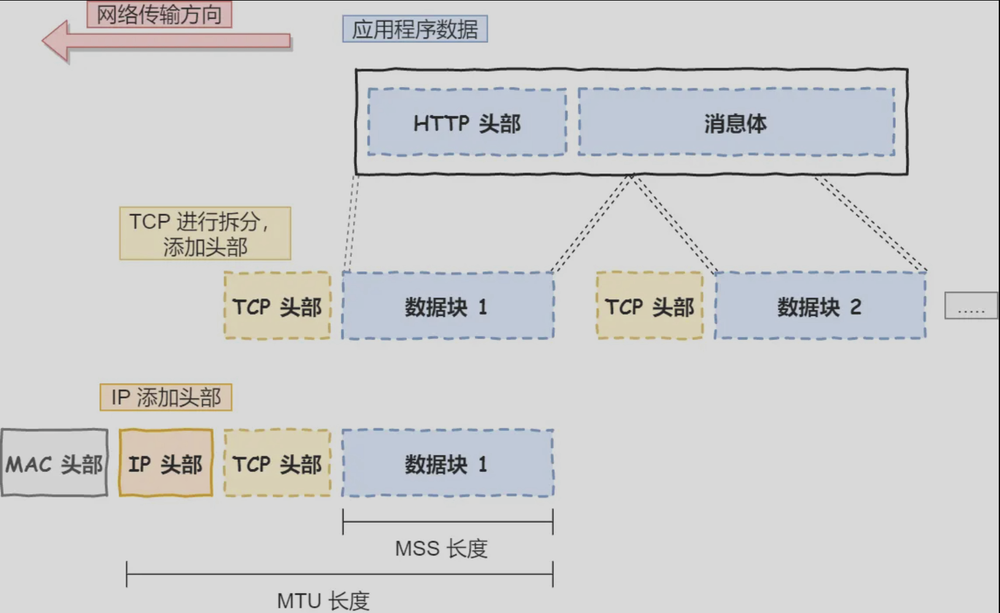
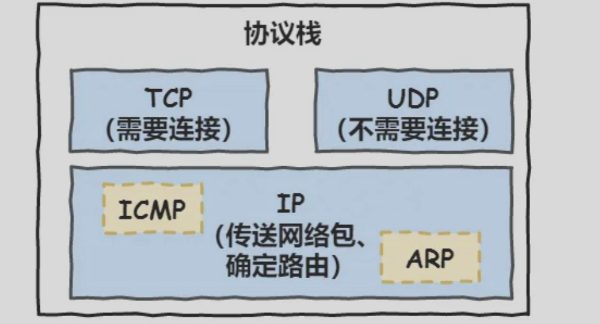
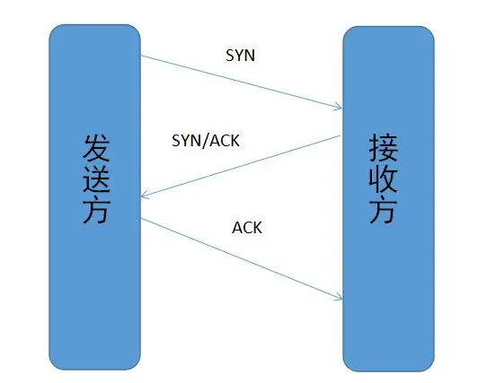
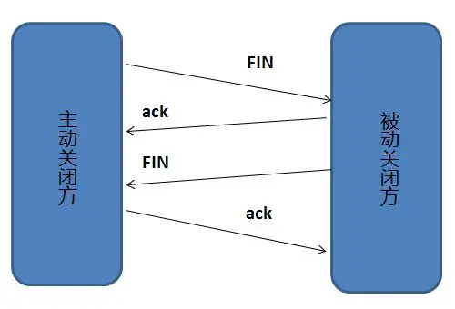
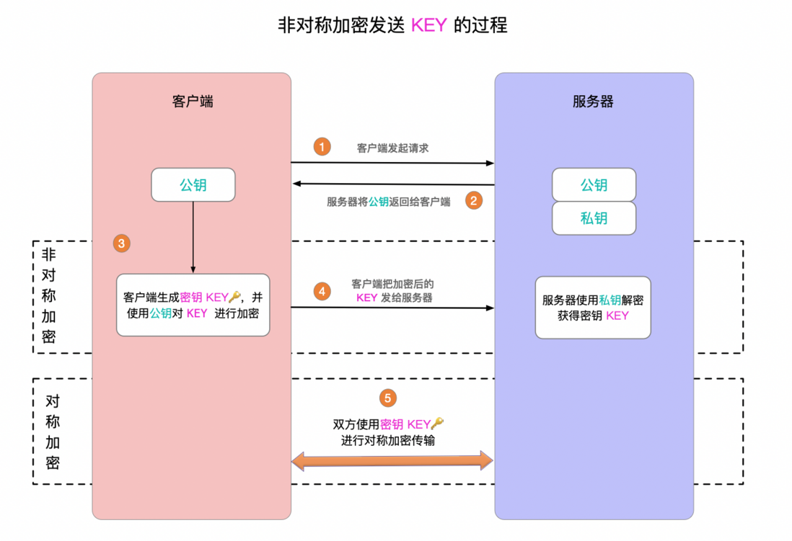

## 五层协议

数据传输过程概况：



1.主机进程在应用层发送数据形成**HTTP消息报文**，报文到运输层**加上TCP或UDP报头**，继续被送到网络层添加目的主机IP地址包装成**IP数据报**，网络层也会选择合适的路由使得数据确定最终发送到的目的主机。

2.链路层把IP数据报**添加mac地址**和**控制信息**封装成**帧**，通过链路发送给另一台主机。

3.数据传输过程是在物理层上的**比特流**传输。

4.到达目的主机，被层层解包，发送到物理层，网络应用获取HTTP报文。

概念辨析

主机应用进程间的通信和交互 = 网络应用，一种进程间的通信和交互实现一种特定的网络应用

xxx的协议=xxx的规则

通用的：不局限于特定的一种，而是多种

分组=网络层封装的IP数据包

### 应用层

应用层任务：通过主机应用**进程间的通信和交互**来完成特定**网络应用**

应用层协议定义的是主机应用**进程间的通信和交互**的**规则**

应用层协议包括**域名系统 DNS**，支持万维网应用的 **HTTP 协议**，支持电子邮件的 **SMTP 协议**

我们把应用层交互的数据单元称为**报文**。

### 运输层

运输层的主要任务：负责**两台主机进程之间的通信**提供**通用的**数据传输服务。应用进程们都利用该服务传输应用层报文。通用的是指多种应用可以使用同一个运输层服务。

数据单元还是应用层**报文**。

运输层有TCP和UDP两种协议：

#### 传输控制协议 TCP（Transmisson Control Protocol）

1.提供**面向连接**的，**可靠的**数据传输服务。

> 连接：就好像打电话一样，通话前需要先拨号建立连接，通话结束后要挂机释放连接。TCP的连接要进行三次握手，断开连接要进行四次挥手

2.TCP面向字节流（把上面应用层交下来的数据看成无结构的字节流来发送）

3.TCP是点对点

4.TCP是全双工通信

> 全双工：允许通信双方的应用进程在任何时候都能发送数据

5.传输效率较低

#### 用户数据协议 UDP（User Datagram Protocol）

1.提供**无连接**的，尽最大努力的数据传输服务（**不保证数据传输的可靠性**）。

2.UDP面向报文

3.UDP 支持一对一、一对多、多对一和多对多的交互通信

4.传输效率较高

### 网络层

网络层的任务是：

1.把运输层产生的报文段或用户数据报，添加IP头部封装成**分组和包**进行**寻址**和传送。

在TCP/IP体系结构中，由于网络层使用 **IP 协议**也就是无连接的**网际协议**（Intert Prococol），因此分组也叫 **IP 数据报** ，简称 **数据报**。IP头部存放目标地址IP，通过子网掩码**获取目的主机的网络号和主机号**，以此进行寻址。

`ICMP协议` 用于告知网络包传送过程中产生的错误以及各种控制信息。

`ARP协议` 用于根据目的地址IP查询相应的以太网 MAC 地址。位于数据链路层和网络层之间。

`ICMP协议`、`ARP协议`和`IP协议`同属于TCP/IP协议栈



> 在 IP 协议里面需要有源地址 IP 和 目标地址 IP：
>
> 源地址IP，即是客户端输出的 IP 地址； 
>
> 目标地址IP，即通过 DNS 域名解析得到的 Web 服务器 IP。
>
> 源地址的计算：根据目标IP地址通过子网掩码计算目标网络号，与路由表对照，符合destination的网卡的ip地址就是源地址ip。

2.网络层 **IP 协议**的另一个任务就是**选择合适的路由**到达目的主机。

> 这里要注意：不要把运输层的“用户数据报 UDP ”和网络层的“ IP 数据报”弄混。另外，无论是哪一层的数据单元，都可笼统地用“分组”来表示。

### 数据链路层

两台主机之间的数据传输，总是在一段一段的链路上传送的，这就需要使用专门的链路层的协议

任务：

1.在两个相邻节点之间传送数据时，**数据链路层将网络层交下来的 IP 数据报添加MAC头部，并添加控制信息组装程帧**，在两个相邻节点间的链路上传送帧。每一帧包括数据和必要的控制信息（如同步信息，地址信息，差错控制等）。

2.接收端接收到数据之后，通过数据中的控制信息知道数据从哪个bit开始，哪个bit结束，**提取数据部分**，上交网络层。通过数据中的控制信息**检测帧中的错误**如果发现差错，要进行丢弃或纠错。

### 物理层

 物理层(physical layer)的作用是**实现相邻计算机节点之间比特流的透明传送**，**尽可能屏蔽掉具体传输介质和物理设备的差异**（使其上面的数据链路层不必考虑网络的具体传输介质是什么）。在物理层上所传送的数据单位是**比特**。

## TCP 三次握手和四次挥手

### 三次握手

- 客户端–发送带有 SYN 标志的数据包–一次握手–服务端
- 服务端–发送带有 SYN/ACK 标志的数据包–二次握手–客户端
- 客户端–发送带有带有 ACK 标志的数据包–三次握手–服务端



三次握手的原因：发送方和接收方各自确认自己和对方的发送与接收正常

回传SYN的原因：告诉发送端，我接受到的SYN就是你发送的，证明发送发到接收方通道没问题

传ACK的原因：用于检测接收方到发送方的通道，如果发送发能再传这个ack到接收方，说明接收方到发送方的通道没问题

### 四次挥手



客户端-发送一个 FIN，用来关闭客户端到服务器的数据传送

服务器-收到这个 FIN，它发回一 个 ACK，确认序号为收到的序号加1 。和 SYN 一样，一个 FIN 将占用一个序号

服务器-关闭与客户端的连接，发送一个FIN给客户端

客户端-发回 ACK 报文确认，并将确认序号设置为收到序号加1

四次挥手的原因：

任何一方在数据传输结束后发出释放连接通知，待对方确认后进入半关闭状态。此时另一方还可以传输数据。当另一方也没有数据再发送的时候，则发出连接释放通知，对方确认后就完全关闭了TCP连接。

## 状态码

状态码第一位数字决定了不同的响应状态，有如下：

- 1 表示消息
- 2 表示成功
- 3 表示重定向
- 4 表示请求错误
- 5 表示服务器错误

## DNS

域名系统，进行域名与之相对应的IP地址的转换

...（后续略）

## CDN

略

## HTTP

概念：

超文本传输协议(HyperText Transfer Protocol)，是一种数据传输规则

传输的数据:并不是计算机底层中的二进制包，而是完整的、有意义的数据，如HTML 文件, 图片文件, 查询结果等**超文本**，能够被上层应用识别

传输的规则：数据由A传到B或将B传输到A，A 与 B 之间可以有很多其他节点，但最终在规则指导下可以从A正确传到B

特点：

- 支持客户/服务器模式

- 简单快速：客户向服务器请求服务时，只需传送请求方法和路径。由于HTTP协议简单，使得HTTP服务器的程序规模小，因而通信速度很快

- 类型灵活：HTTP允许传输任意类型的数据对象。正在传输的类型由Content-Type加以标记

- 无连接（不保持链接）：无连接的含义是限制每次连接只处理一个请求。服务器处理完客户的请求，并收到客户的应答后，即断开连接。采用这种方式可以节省传输时间

- 无状态（不保存状态）：HTTP协议无法根据之前的状态进行本次的请求处理（不便于处理有关联的请求操作，比如登录之后添加购物车下单结算，每次请求服务器都需要问一遍身份信息，通常使用cookie、token来解决，带上他们请求服务器就知道用户信息）

- 使用明文传输，不验证通信双方的身份，无法证明报文的完整性
## HTTP1.0/1.1/2.0/3.0 的区别

### HTTP1.0

- **使用短连接**：浏览器与服务器只保持短暂的连接，浏览器的每次请求都需要与服务器建立一个TCP连接

### HTTP1.1

- **默认使用长连接**：引入了持久连接，即TCP连接默认不关闭，可以被多个请求复用，会在响应头加入这行代码：

HTTP/1.1 版本的默认连接都是长连接，但为了兼容老版本的 HTTP，需要指定 Connection 首部字段的值为 Keep-Alive。

```
Connection:keep-alive
```

- **管道网络传输**（注意不是默认开启的）：客户端可以同时发送多个请求，减少整体的响应时间。但即使开启这个功能解决了解决了**请求的队头阻塞**，但是服务器的还是会有响应对头阻塞问题。不开启就会同时有请求和响应的阻塞问题。

- **队头阻塞**：虽然允许复用TCP连接，但是同一个TCP连接里面，请求和响应是**按次序进行的**，服务器只有处理完一个请求，才会接着处理下一个请求。如果前面的处理特别慢，后面就会有许多请求排队等着，导致浏览器一直获取不到数据（获取不到数据也无法发送后续的请求，默认不开启管道传输）。
- 新增了一些请求方法：put`、`delete`、`options
- 新增了一些请求头和响应头：If-Unmodified-Since, If-Match, If-None-Match

### HTTP2.0

HTTP/2 协议是基于 HTTPS 的，所以 HTTP/2 的安全性也是有保障的。

- **二进制分帧**：采用**二进制格式**而非文本格式（1、将请求和响应数据分割为更小的帧，并且它们采用二进制编码，提升传输效率。2、一个连接可以承载多个请求、也就是多条数据流，每个帧会标识出该帧属于哪个数据流，多个帧之间可以乱序发送）

​		HTTP1.1是按字符存储，再解析为二进制使用，存储量较大。

​		HTTP2.0是按二进制存储，不用解析，且存储量较小。

- **多路复用**：只需一个连接即可实现多条数据流**并行**，同时发送而非有序并阻塞的(在一个连接里，客户端和浏览器都可以**同时**发送多个请求或回应,而且不用按照顺序一一对应，这样就避免了”队头堵塞”)

>在 HTTP/2 中，有两个非常重要的概念，分别是帧（frame）和流（stream）。帧代表着最小的数据单位，每个帧会标识出该帧属于哪个流，流也就是多个帧组成的数据流。
>
>消息首部/消息头部/HTTP头部=请求头或响应头
>
>一个请求报文+一个响应报文=一个HTTP消息=同属一个请求
>
>一个TCP连接里可以有多个HTTP请求，每个请求都是一条数据流Stream，数据流是个通道，里面有许多消息Message（Request Message/Response Message，代表请求或响应发送的报文），消息里面有一个或多个帧Frame（HTTP2的最小单位，这些帧以二进制的形式存放头部和包体）。
>
>针对不同的 HTTP 请求用独一无二的 Stream ID 来区分，接收端可以通过 Stream ID 有序组装成 HTTP 消息，不同 Stream 的帧是可以乱序发送的，因此可以并发不同的 Stream ，也就是 HTTP/2 可以并行交错地发送请求和响应。

- 使用**首部压缩**，降低开销（两端维护了首部表，以键值对的方式存储之前发送的头部键值对，相同的请求头不再重新发送，协议会消除重复的部分）
- **服务器推送**，允许服务端主动推送资源给客户端。（服务器会顺便把一些客户端需要的资源一起推送到客户端，如在响应一个页面请求中，就可以随同页面的其它资源。免得客户端再次创建连接发送请求到服务器端获取，这种方式非常合适加载静态资源）

参考：https://www.xiaolincoding.com/network/2_http/http_interview.html#http-2-%E5%81%9A%E4%BA%86%E4%BB%80%E4%B9%88%E4%BC%98%E5%8C%96

### HTTP3.0（了解）

- 使用UDP：HTTP2.0虽然解决了HTTP的队头阻塞问题，但是由于TCP丢包后会触发重传机制，一个TCP连接中的所有HTTP请求都需要等保重传回来才能继续发送，这就是TCP的队头阻塞。所以HTTP3.0就改用UDP。

- HTTP3.0使用了QUIC协议

  QUIC 基于 UDP 实现，是 HTTP/3 中的底层支撑协议

  QUIC 有以下 3 个特点。
  
  - 无队头阻塞
  
    QUIC原生实现了多路复用，当某个流发生丢包时，只阻塞这个流，不影响其他流，这就解决了只用一个TCP连接时发生丢包导致整个TCP所有数据流都要重传的问题，因此不存在TCP重传的队头阻塞问题。
  
  - 更快的连接建立
  
    HTTP2.0是将TCP与TLS分层的，TCP与TLS需要分别进行握手。QUIC也需要握手，但是内部已经包好了TLS，所以只需要QUIC握手即可。
  
  - 连接迁移
  
    

## HTTPS

### 定义

HTTPS=HTTP+TLS/SSL

HTTP存在问题：

- 通信使用明文（不加密），内容可能被窃听
- 不验证通信方的身份，因此有可能遭遇伪装

### SSL

SSL(Secure Sockets Layer 安全套接字协议),及其继任者传输层安全（Transport Layer Security，TLS）是为网络通信提供安全及数据完整性的一种安全协议

- 对称加密：采用协商的密钥对数据加密解密

- 非对称加密：实现身份认证和密钥协商

#### 混合加密

SSL使用了混合加密，即对称加密+非对称加密。使用非对称加密一个对称密钥之后安全交换该密钥，双方传输数据时需要使用这个对称密钥



  步骤：

  1.服务端拥有公钥和私钥，并散发公钥。客户端得到公钥，并生成一个对称密钥key用于之后加密和解密本次传输的数据。

  2.客户端使用公钥加密对称密钥key，发送给服务端，服务端使用私钥解密获得对称密钥key

  3.双方使用对称密钥进行数据的加密传输

#### 摘要算法：验证信息的完整性

加密数据之后，还要保证数据的完整性，使用摘要算法实现

摘要算法包括散列函数、哈希函数。可以理解成一种特殊的压缩算法，它能够把任意长度的数据“压缩”成固定长度、而且独一无二的“摘要”字符串，就好像是给这段数据生成了一个数字“指纹

发送方在原文之后加一个生成的SHA-2的摘要。接收方收到后也计算一下消息的摘要，然后进行对比，如果一直就表示消息是完整的

#### 数字签名：数据发送者的身份验证

注意📢：服务端发送数据给客户端时需要进行数字签名，客户端给服务端发数据时验证身份用的是cookie和token

验证消息确实是从当前的服务端发送出来的

服务端持有自己的私钥，散发公钥，客户端接收方获取公钥

服务端使用私钥对当前发送数据的摘要进行加密形成数字签名，客户端获取数据（原文+摘要的数字签名）后使用**公钥**解密签名，如果可以解密说明来自当前的发送方。

然后再对数据进行计算获取新摘要对比解密出来的摘要验证完整性。

#### 数字证书：确保公钥确实是来自发送方

现在发送方不再直接给客户端公钥，而是给数字证书，包含个人信息 + 公钥 + 数字签名。数字证书由数字证书认证机构CA颁发，其中数字签名是CA用自己的私钥 对个人信息和公钥打包 计算Hash值之后加密形成的。

客户端用CA公钥解密数字签名得到Hash值1，再对个人信息和公钥打包计算得到Hash值2，比较Hash值1和Hash值2，相同就表示证书确实来自想要传输数据的服务端，证书是可信赖的，所以证书的公钥是可信赖的，接收方拿到服务端的公钥。如果CA公钥解密签名失败或者解密之后发现Hash值对不上，直接认为证书是伪造的。

数字证书的应用：

1.HTTPS数据传输使用**混合加密**时，服务端给客户端一个公钥，客户端用来对对称密钥进行加密后传输给服务端。这里服务端不直接给公钥，而是给数字证书，客户端验证证书可信赖之后，拿到公钥。

2.服务端给客户端传输数据时，服务端对数据摘要用私钥进行加密后形成**摘要的数字签名**和数据一起发送给客户端，服务端会先给客户端公钥。客户端用公钥进行解密，如果解密成功，就验证了数据是来自服务端的。这里也不直接给公钥，而是给数字证书，客户端验证证书可信赖之后，拿到公钥。

### 加密方式总结

**公钥加密，私钥解密**。这个目的是为了**保证内容传输的安全**。因为被公钥加密的内容，其他人是无法解密的，只有持有私钥的人，才能解密出实际的内容；

**私钥加密，公钥解密**。这个目的是为了**保证消息不会被冒充**，因为私钥是不可泄露的，如果公钥能正常解密出私钥加密的内容，就能证明这个消息是来源于持有私钥身份的人发送的。

### HTTPS建立连接的过程

SSL/TLS 协议基本流程： 

- 客户端向服务器索要并验证服务器的公钥。

- 双方协商生产「会话秘钥」。

- 双方采用「会话秘钥」进行加密通信。

前两步也就是 SSL/TLS 的建立过程，也就是 TLS 握手阶段。TLS 的「握手阶段」涉及**四次**通信。

### SSL/TLS协议的组成

TLS分为握手协议和记录协议两层

- 握手协议就是之前的四次握手，负责协商加密算法和生成对称密钥，后续传输都用对称密钥加密数据

- 记录协议负责保护应用程序数据并验证其完整性和来源

### HTTP与HTTPS的区别

- HTTP 是超文本传输协议，信息是明文传输，存在安全风险的问题。HTTPS 则解决 HTTP 不安全的缺陷，在 TCP 和 HTTP 网络层之间加入了 SSL/TLS 安全协议，使得报文能够**加密传输**。 
- HTTP 连接建立相对简单， TCP 三次握手之后便可进行 HTTP 的报文传输。而 HTTPS 在 TCP 三次握手之后，**还需进行 SSL/TLS 的握手过程**，才可进入加密报文传输。
- HTTPS使用**摘要算法**保证数据的完整性
- HTTPS 协议需要向 CA（证书权威机构）申请**数字证书**，来保证服务器的身份是可信的。 
-  两者的默认端口不一样，HTTP 默认**端口号**是 80，HTTPS 默认端口号是 443。

## Web安全

待补充

参考：

https://juejin.cn/post/6844903662838349838#heading-31

https://mp.weixin.qq.com/s/wrOXO5MH4wtbuvrCPCQNQA

https://segmentfault.com/a/1190000021494676
